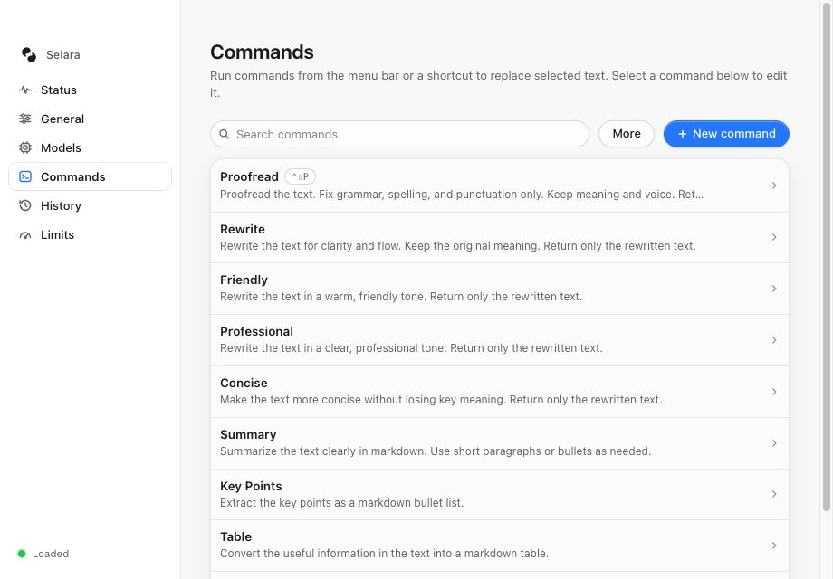
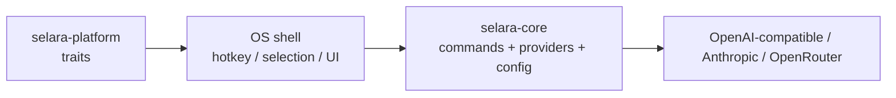
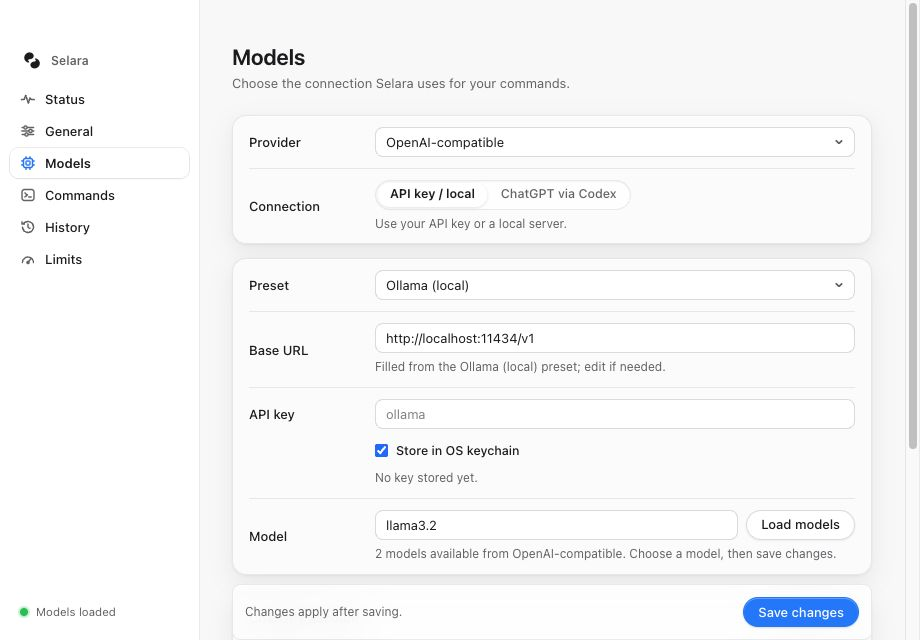
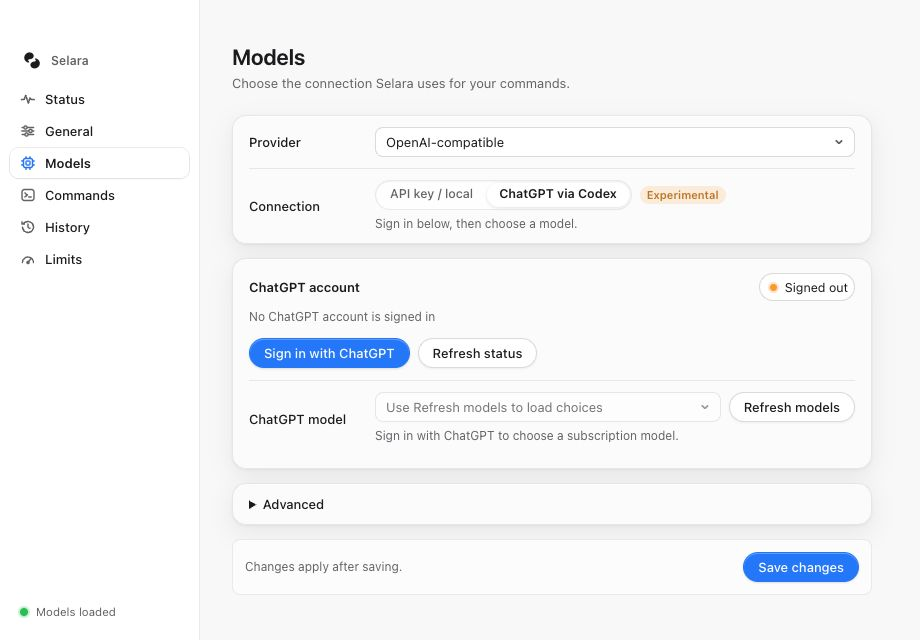
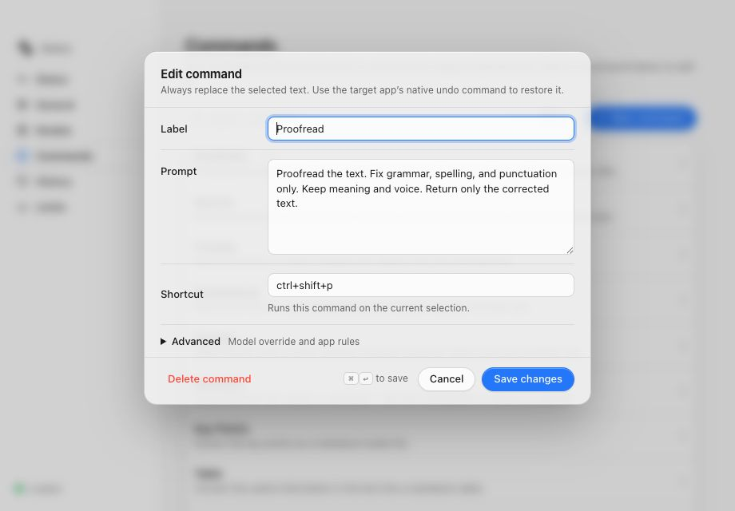

# Selara

[](https://github.com/snowopsdev/selara/actions/workflows/ci.yml)
[](LICENSE)

Select text in any app, press a hotkey, and rewrite it with the LLM of your choice.

Selara is a writing assistant for macOS built on a Rust core. It reads your current selection, runs it through a prompt you control, and replaces the selected text with the completed result. Bring your own key for OpenAI-compatible endpoints (OpenAI, Ollama, LM Studio, vLLM), Anthropic, or OpenRouter, or reuse your ChatGPT login through the bundled native Codex writing runtime.

<p align="center">
  <picture>
    <source media="(prefers-color-scheme: dark)" srcset="docs/screenshots/settings-commands-dark.jpg">
    
  </picture>
</p>

Inspired by [theJayTea/WritingTools](https://github.com/theJayTea/WritingTools). Selara is a clean-room architecture, not a port.

## Features

- **Works wherever text is selected.** A global hotkey (default `ctrl+shift+space`) opens the custom-instruction dialog. Configured commands are available from the menu bar and their own shortcuts. Selara reads a nonempty selection through macOS Accessibility and writes the finished result back over that selection.
- **Selection stays explicit.** If no text is selected, Selara shows **Select text first** and does not send a request or paste stale clipboard contents. Clipboard-assisted capture is used only when fresh copied text and the original target can both be verified.
- **Free-form instruction.** The custom-instruction hotkey opens a small dialog for a one-off instruction. The dialog recalls the last ten instructions (↑ in the empty field) and offers **Save as command…** so useful instructions can be added to the menu bar.
- **Every command replaces the selection.** Proofread, Rewrite, Friendly, Professional, Concise, Summary, Key Points, Table, Translate, and custom commands all write the completed result over the selection while retaining formatting requested by the prompt.
- **Complete results only.** Selara shows compact progress and cancellation controls while the model runs, then performs one replacement after the full response arrives. Escape cancels the run without changing the document. CLI output is buffered by default; `--no-stream` remains accepted for compatibility.
- **Your prompts.** Every command is a labeled prompt. Edit the built-ins, add your own, duplicate one to make a variation, and search the list. Prompts can use `{{language}}` (your preferred language) and `{{app}}` (the app the selection came from); the built-in **Translate** command is `Translate the text to {{language}}`.
- **Per-command hotkeys.** Give a command its own shortcut and it runs on the current selection immediately. Large or secret-shaped selections show a compact confirmation before the request is sent; the hard maximum cannot be overridden.
- **Excluded apps.** List password managers, terminals, or anything else by name or bundle id and the hotkeys do nothing there: no command, selection, or clipboard read.
- **Native undo and cancel.** Pressing Escape while a command is running discards its result instead of replacing anything. After a replacement, use the target app's native ⌘Z to restore the original text.
- **History.** The last 50 transformations (original and result, which command, which app) are kept in `history.jsonl` next to the config, and the Settings app lists them with **Copy result** and **Copy original** buttons. Historical entries from older releases remain readable.
- **Any provider.** OpenAI-compatible `/chat/completions` (OpenAI, Ollama, LM Studio, vLLM), the Anthropic Messages API, or OpenRouter. Leave the base URL blank for the provider default or point it at a local server.
- **Model discovery.** Load the model list straight from the provider. A bad key or URL shows up right there, so it doubles as a connection test.
- **ChatGPT via Codex (experimental).** Reuse your existing ChatGPT login through a bundled native writing runtime. Credentials stay in Codex’s file or Keychain store; no separate Codex installation or Node is required.
- **Size limits.** A soft warning, a replacement caution, and a hard maximum, so a stray select-all never sends 100k characters to a metered API. They apply to menu, custom-instruction, and shortcut runs alike.
- **Secret guard.** If the selection looks like it holds an API key, a private key block, a JWT, or a card number, Selara asks before sending it to a hosted provider; local servers are exempt.
- **Live config.** Everything lives in one TOML file. The `serve` process watches the config directory for changes and re-registers hotkeys as soon as the Settings app saves (with a 5-second poll as a fallback), while staying idle otherwise.
- **Menu-bar Settings app.** A Tauri tray app with Status, General, Models, Commands, History, and Limits tabs. The Status tab shows whether `serve` is running, whether Accessibility is granted, and whether the provider answers. No Dock icon, closes to the tray.
- **Local usage and cost.** Every request's token counts are appended to `usage.jsonl` next to the config, so the Status tab and `selara usage` can show today, last 30 days, and all-time totals with an estimated cost for well-known models called on their own vendor's API. The numbers are local only and never sent anywhere; costs are estimates from a built-in list-price table, and local or custom endpoints stay unpriced.
- **Scriptable CLI.** `selara init`, `selara list-commands`, `selara run <command>`, `selara usage`, and `selara key set|clear|status` for pipelines and quick checks.
- **Keys in the keychain.** API keys go into the OS credential store (macOS Keychain) by default; `config.toml` stays free of secrets unless you choose otherwise.

## How it works



| Crate | Role |
| --- | --- |
| `crates/selara-core` | Commands, config, providers |
| `crates/selara-platform` | Traits for selection / hotkey / clipboard (+ macOS backend) |
| `apps/selara` | CLI + macOS `serve` desktop shell |
| `apps/selara-desktop` | Tauri tray + Settings UI |

The `serve` shell registers the custom-instruction and command hotkeys, builds the menu-bar command list, reads the current selection, sends `{prompt, selection}` to the configured provider, and replaces the selection only after a complete successful response. The Settings app edits the same config file.

## Install (macOS)

Every GitHub Release ships a `Selara-<version>-macos-arm64.dmg` (the menu-bar app), a `selara-<version>-macos-arm64.tar.gz` (the CLI), and Homebrew files. With the tap configured:

```bash
brew tap snowopsdev/selara
brew install --cask selara      # menu-bar app
brew install selara             # CLI
```

Until the release is signed and notarized by Apple, macOS may report the app as damaged on first launch; clear the quarantine flag with `xattr -d com.apple.quarantine /Applications/Selara.app`. Only verified notarized releases remove this caveat. The first upgrade from v0.4.1 must be installed manually; see [release and update recovery](docs/release-updater.md). Building from source is described next.

## Quick start (macOS)

1. **Create the config** (once):

   ```bash
   cargo run -p selara -- init
   ```

2. **Set an API key.** Store it in the OS keychain (macOS Keychain):

   ```bash
   echo -n sk-... | cargo run -p selara -- key set
   ```

   Or export `SELARA_API_KEY`, which always wins, or open the Settings app (next section) and paste it into the Models tab, where "Store in the OS keychain" is on by default. Local servers such as Ollama accept any placeholder key. Lookup order is environment, keychain, then `provider.api_key` in `config.toml`. macOS asks once per binary before another program may read a keychain item, so `cargo run` builds prompt again after each rebuild; the packaged app does not.

3. **Grant Accessibility.** System Settings → Privacy & Security → Accessibility, then enable Terminal or iTerm (whichever runs `cargo run`) or the `selara` binary itself. macOS may prompt on first launch, and starting `serve` also triggers the prompt.

4. **Start the shell.** The Settings app (next section) starts `serve` for you, restarts it if it crashes, and can start at login (General → Start at login). From a terminal it also works on its own:

   ```bash
   cargo run -p selara -- serve
   ```

   The app never starts a second copy while one is running elsewhere. Accessibility must be granted to whatever runs `serve`: the app bundle when it is managed, or the terminal / sidecar binary under `apps/selara-desktop/src-tauri/binaries/` during `tauri dev`.

5. Select text in TextEdit, Notes, Mail, or anywhere else, then choose a command from the Selara menu bar. You can also assign a command shortcut in Settings, or press `ctrl+shift+space` to enter a custom instruction.

To open the Settings app:

```bash
cd apps/selara-desktop && npx tauri dev
```

It lives in the menu bar. Left-click the icon (or choose **Open Settings**) to show the window. Closing the window hides it. **Quit** exits.

Use the Tauri command rather than `cargo run -p selara-desktop`. A debug build loads the Vite dev server that `tauri dev` starts for it, so running the binary alone opens a blank window.

## Settings app tour

Every tab writes to the same `config.toml`. If `serve` is running, saved changes apply within about a second.

### Status

The tab the app opens on. Five cards answer "is everything in place?" and "what has this cost?" without reading `serve`'s terminal output:

- **selara serve**: whether the shell is running, with its pid. `serve` writes `serve.pid` next to the config file while it runs and removes it on exit; the card shows the path and the command to start it.
- **Accessibility**: whether macOS Accessibility is granted, with an **Open Accessibility settings** button when it is not. The grant shown is the Settings app's own; the program that runs `serve` (Terminal, iTerm, or the `selara` binary) needs the same grant.
- **Provider**: the saved provider, model, base URL, and auth mode. **Check connection** lists models with the saved key (or checks the Codex sign-in for ChatGPT via Codex) and reports "Reachable · N models" or the error text. The API key is never displayed.
- **Shortcuts**: the custom-instruction hotkey and every command that has its own shortcut.
- **Usage**: tokens in and out for today (your local calendar day), the last 30 days, and all time, with an estimated cost when the model is in the built-in price table *and* the request went to that vendor's own API ("n/a" for local, custom, or unlisted endpoints — an alias served by Ollama or a proxy is never billed at OpenAI's rate). The ledger is `usage.jsonl` next to the config, local only and never sent anywhere; **Clear** empties it. Costs are estimates, not a bill.

**Refresh** re-reads the config and re-runs the checks. No screenshot yet; it will be added with the next screenshot pass.

### General

The global shortcut that opens the custom-instruction dialog, plus a preferred language code. The language fills `{{language}}` in prompts and is added to every prompt as a hint: the model replies in that language unless the command itself names an output language (a "Translate to French" command wins) or the selected text is clearly written in another one, in which case it keeps the text's language.

**Excluded apps** lists apps where the hotkeys should do nothing, one per line, by localized name (`1Password`) or bundle id (`com.apple.Terminal`), matched case-insensitively. End an entry with `*` to match a prefix (`com.apple.*`, `iTerm*`). When the frontmost app is on the list, `serve` logs the ignored press and neither opens a window nor reads the selection or clipboard.


### Models

Pick a provider and connection, then select a model. The active connection's controls appear first, and **Save changes** stays visible while the form scrolls. Changes take effect after saving; a failed save keeps your draft and shows an error beside Save.

With an **API key**, type a model id or press **Load models** to fetch the list from the provider. For the OpenAI-compatible provider, a **Preset** menu fills in the base URL and key hint for OpenAI, Ollama, LM Studio, vLLM, Groq, Mistral, Gemini, Together, and DeepSeek; pick **Custom endpoint** for anything else. The screenshot shows a local Ollama server on the OpenAI-compatible endpoint. The hint under the model field reports how many models came back, or the HTTP error if the key or URL is wrong.



With **ChatGPT via Codex** (experimental, OpenAI-compatible provider only), Selara puts account sign-in and model selection together. It reuses your shared Codex account, provides browser sign-in, and lists the models available to that account. Your address is masked in the status chip by default.

In API/local mode, the shared account appears below the connection fields. Expand **Manage shared account** to access its controls. **Advanced** holds the optional Codex home path and account details. Switching connection modes or refreshing account status preserves your unsaved provider fields and key-storage choice.



### Commands

The list of prompts available from the Selara menu bar. Every command replaces the current selection, and rows show a command shortcut when one is configured. Search filters the list. Hover or focus a row to duplicate or delete it. **More** opens the command-pack controls: **Export…** saves every command as a TOML pack (`[[commands]]` tables, the same shape as `config.toml`), and **Import…** merges a TOML or JSON pack back in. Choose how to handle existing command IDs before importing: keep both under a new ID, replace yours, or skip. Imported hotkeys that are already taken are dropped rather than duplicated.


Click a row to edit it. The editor holds the label, prompt, and optional shortcut. **Advanced** contains the optional model override and app rules. The model override uses the same provider and key. Every saved command uses replacement behavior. Save and Cancel stay visible while the form scrolls; `⌘↩` saves and Escape closes the editor when no save is pending. A failed save keeps your draft open with an error and **Retry save**. The list changes only after a successful save.

**Apps** narrows a command to the apps it belongs in: a menu action or shortcut is ignored outside those apps. The field is comma-separated app names or bundle ids (a trailing `*` matches by prefix), and leaving it empty — the default for every built-in command — offers the command everywhere. Custom instructions follow the global excluded-app rules.

```toml
[[commands]]
id = "reply"
label = "Draft reply"
kind = "replace"
prompt = "Draft a short reply to this message."
apps = ["Mail", "com.apple.Notes"]
```



### History

Every command that finishes while `serve` runs is recorded: the time, the command, the app the selection came from, a preview of the original text and the result, and **Copy result** / **Copy original** buttons that put either back on the clipboard. **Clear history** deletes the whole list after a confirmation. Historical records from older releases remain readable.

Restoring is a clipboard copy on purpose: putting text back into the source app needs that app's focus and Accessibility, which the Settings window does not have. To restore a replacement in the source app, use that app's native ⌘Z.

Privacy: the list lives in `history.jsonl` in the config directory (`~/.config/selara/` by default), is kept readable only by you (mode 0600, re-applied on every append), holds the selected text and the results verbatim, and is trimmed to the newest 50 entries. Clear it from the tab, or delete the file, if you would rather not keep it around.

### Limits

Guard rails for large selections. Set any value to `0` to disable the corresponding warning. The soft warn, replacement caution, and secret guard are compact confirmations shown before a request or replacement. A command is never sent past the hard maximum.

| Setting | Default | Effect |
| --- | --- | --- |
| Soft warn | 8000 chars | Ask before sending a large selection |
| Hard max | 100000 chars | Refuse anything larger |
| Replace caution | 4000 chars | Ask again before overwriting a large selection |
| Secret guard | on | Ask before sending secret-shaped text (API keys, private keys, JWTs, card numbers) to a hosted provider; local servers (`localhost`, `.local`, private IPs) are exempt |


## Providers and config

Default config path: `~/.config/selara/config.toml`. The file is written atomically (temp file + rename) with owner-only permissions (`0600`), and the Settings app saves one tab at a time, so saving one section preserves changes to other sections and commands saved from the instruction dialog. A `schema_version` key records the file format (currently `2`); versionless files are read as version 1 and migrated in memory. Legacy popup commands are normalized to replacement behavior while command ids, prompts, models, app filters, and valid shortcuts are preserved.

| `kind` | Wire format | Default `base_url` |
|---|---|---|
| `open_ai_compatible` | OpenAI `/chat/completions` (OpenAI, Ollama, LM Studio, vLLM, ...) | `https://api.openai.com/v1` |
| `anthropic` | Anthropic Messages API | `https://api.anthropic.com` |
| `open_router` | OpenAI-compatible via OpenRouter | `https://openrouter.ai/api/v1` |

Leave `base_url` empty to use the default. Old configs with `kind = "ollama"` still load as `open_ai_compatible`.

Prompt placeholders: `{{language}}` expands to the configured language and `{{app}}` to the name of the app the selection came from (CLI runs use "the current application"). Unknown placeholders are left as written; the selected text itself is always sent as the message, so it needs no placeholder. Configs that list their own `commands` do not gain the new built-in **Translate** command automatically; add a command with the prompt `Translate the text to {{language}}. Return only the translation.` to get it.

Anthropic:

```toml
[provider]
kind = "anthropic"
base_url = ""
model = "claude-opus-5"
```

Ollama:

```toml
[provider]
kind = "open_ai_compatible"
base_url = "http://localhost:11434/v1"
model = "llama3.1:8b"
api_key = "ollama"
```

Environment and paths:

- `SELARA_CONFIG_DIR` overrides the config directory (falls back to the legacy `WRITING_TOOLS_CONFIG_DIR`).
- `SELARA_API_KEY` overrides everything (falls back to the legacy `WRITING_TOOLS_API_KEY`); next comes the OS keychain entry (`selara key set|clear|status`, service `dev.snowops.selara`), then `provider.api_key`.
- `selara --config <path>` overrides the file for a single CLI invocation.
- **Migration:** on first load, if the Selara config is missing but `~/.config/writing-tools/config.toml` exists, it is copied into the Selara path (a one-time message is printed).
- ChatGPT via Codex uses the bundled native writing runtime. Set an absolute `provider.codex_home` in Settings if your shared login is outside `~/.codex`; it takes precedence over `CODEX_HOME`. Remove legacy `CODEX_BIN` and `CODEX_AUTH_JSON` overrides. Signing out affects that shared Codex home, including other Codex clients.

## The `serve` shell in detail

### Hotkey

The custom-instruction shortcut defaults to `ctrl+shift+space`. Plain `ctrl+space` often conflicts with macOS Input Sources and Spotlight, so the default avoids it. Override it in the General tab or in config:

```toml
hotkey = "option+space"
# or: "cmd+shift+w", "ctrl+shift+space", …
excluded_apps = ["1Password", "com.apple.Terminal"]   # optional; hotkeys are ignored in these apps
```

Supported tokens: `ctrl`/`control`, `shift`, `alt`/`option`, `cmd`/`command`/`super`, plus a key: `space`, `a`–`z`, `0`–`9`, `enter`, `tab`, `escape`; function keys `f1`–`f12`; arrows `up`/`down`/`left`/`right`; editing keys `backspace`, `delete`, `home`, `end`, `pageup`, `pagedown`; and the punctuation characters `-` `=` `[` `]` `;` `'` `,` `.` `/` `` ` `` `\`. Tokens are case-insensitive and may be padded with spaces. The same grammar applies to per-command hotkeys.

### Replace strategy

Selara captures the actual nonempty selection and its source application before opening any confirmation or progress UI. After a complete provider response, it revalidates that target and uses the source app's normal paste operation to replace the selection once. If the target changed, disappeared, or cannot be verified, Selara leaves the document untouched. If the result is unwanted, the source app's native ⌘Z restores its own edit.

### Known limitations

- The paste fallback snapshots the whole pasteboard (every type, images included) and only restores it if nothing else was copied in between, so a copy you make during that window wins and the pre-Selara clipboard is dropped.
- Some apps (Electron, browsers, certain rich-text fields) do not expose a stable selection or consume paste slowly. Selara refuses an unverified replacement and never retries an uncertain paste automatically.
- If focus changes while the model runs, or the original selection no longer matches, the command completes without changing the document and reports the reason.
- Global hotkeys need the `serve` process running. The Settings app keeps it running and can register itself as a login item; a bare terminal `serve` still stops when the terminal closes.
- If a hotkey fails to register or never fires, pick another chord.

## CLI

```bash
cargo run -p selara -- init
cargo run -p selara -- list-commands
cargo run -p selara -- run proofread --text "Their going to the store tommorow."
cargo run -p selara -- run summary --text "$(pbpaste)"
```

`run` reads stdin when `--text` is omitted, returns the completed result on stdout, and `--instruct` appends a one-off instruction to the command's prompt. `--no-stream` is accepted for compatibility. `selara usage` prints the local usage ledger as a table (tokens in/out per window and per model, with estimated costs).

## Status

**Done:** config with migration, built-in replacement commands, OpenAI-compatible + Anthropic + OpenRouter providers with model discovery, ChatGPT via Codex (experimental), CLI `init` / `list-commands` / `run`, macOS `serve` (menu commands, custom instructions, replacement, limits, hot reload), Tauri menu-bar Settings.

**Next:**

1. LaunchAgent so `serve` stays resident without a terminal
2. Windows and Linux shells implementing the same platform traits

## Contributing, security, license

- [CONTRIBUTING.md](CONTRIBUTING.md) — clone → test → PR
- [SECURITY.md](SECURITY.md) — how we handle security
- [Report a vulnerability](https://github.com/snowopsdev/selara/security/advisories/new) — private GitHub Security Advisory (preferred)
- [CODE_OF_CONDUCT.md](CODE_OF_CONDUCT.md) — Contributor Covenant 2.1
- [LICENSE](LICENSE) — MIT

CI runs tests on Linux and compiles the macOS shell on `macos-latest`. macOS Accessibility, global hotkeys, `serve`, and the Tauri UI still need local macOS testing when those areas change.
