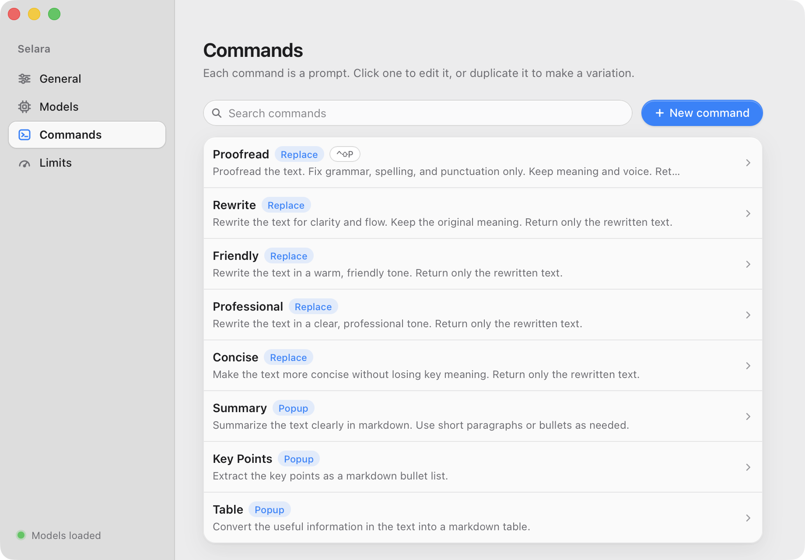
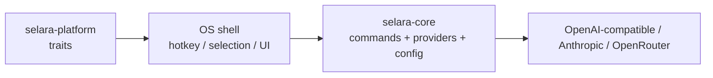
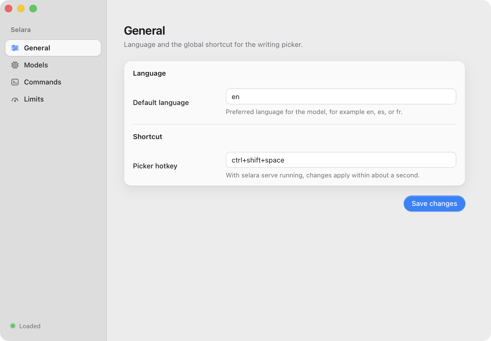
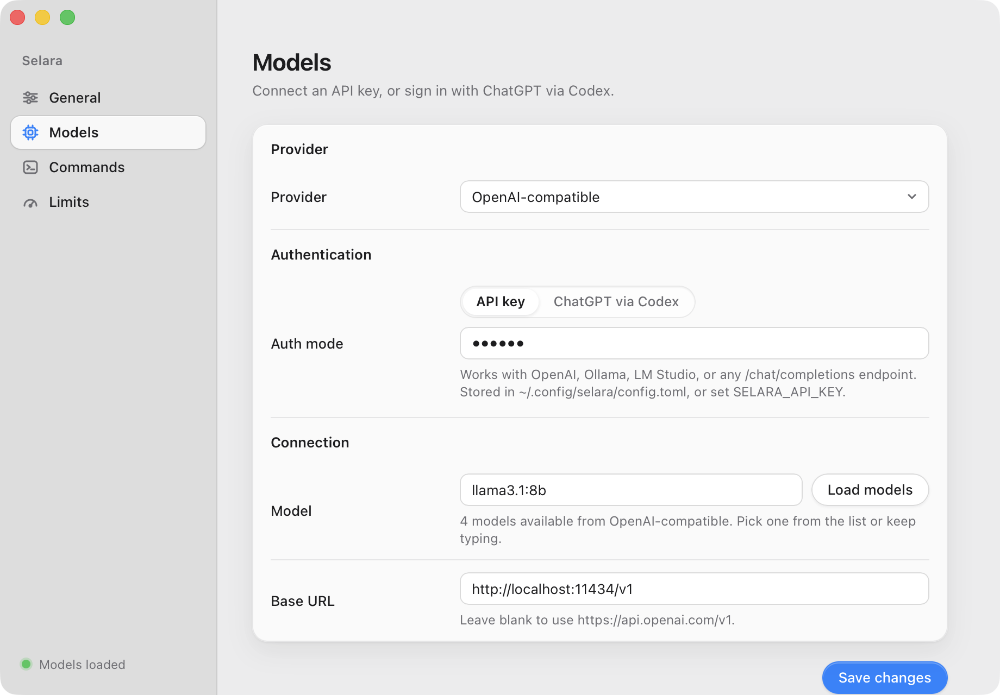
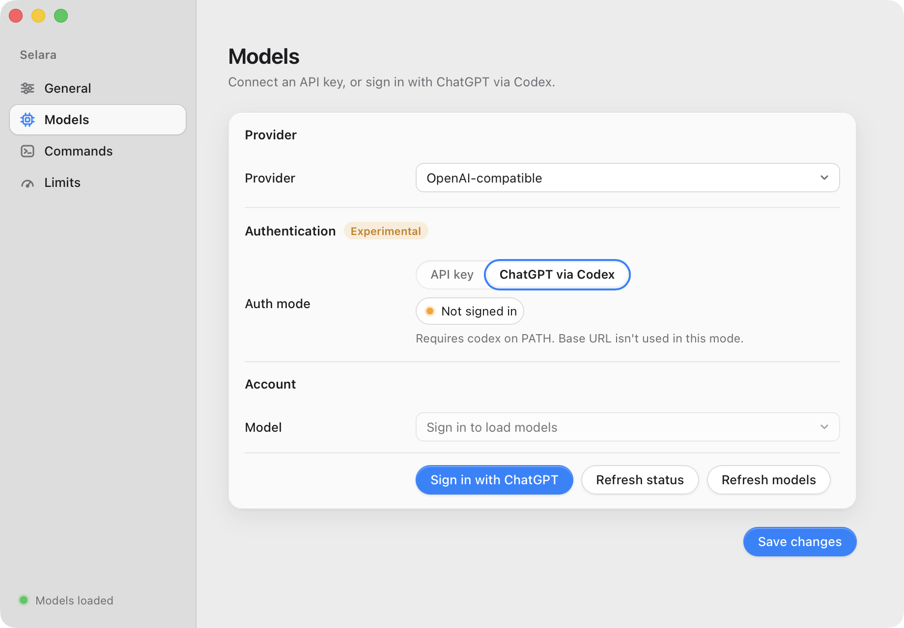
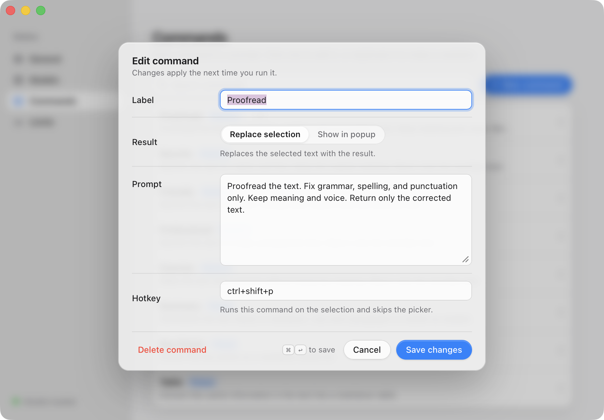
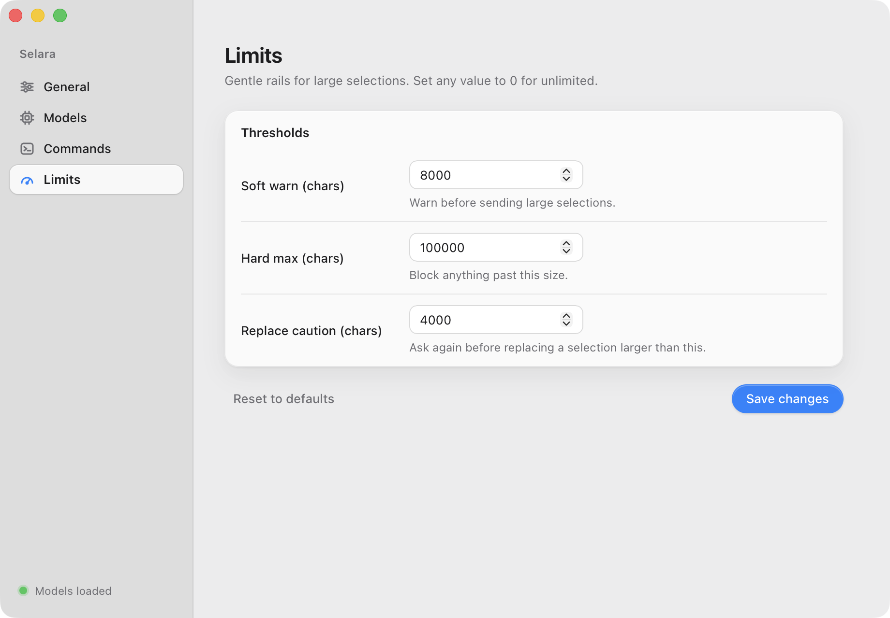

# Selara

[](https://github.com/snowopsdev/selara/actions/workflows/ci.yml)
[](LICENSE)

Select text in any app, press a hotkey, and rewrite it with the LLM of your choice.

Selara is a writing assistant for macOS built on a Rust core. It reads your current selection, runs it through a prompt you control, and either **replaces** the text in place or shows the result in a **popup**. Bring your own key for OpenAI-compatible endpoints (OpenAI, Ollama, LM Studio, vLLM), Anthropic, or OpenRouter, or sign in with ChatGPT through the Codex CLI.

<p align="center">
  <picture>
    <source media="(prefers-color-scheme: dark)" srcset="docs/screenshots/settings-commands-dark.png">
    
  </picture>
</p>

Inspired by [theJayTea/WritingTools](https://github.com/theJayTea/WritingTools). Selara is a clean-room architecture, not a port.

## Features

- **Works everywhere you can select text.** A global hotkey (default `ctrl+shift+space`) reads the selection through macOS Accessibility, with a clipboard fallback for apps that do not expose it.
- **Replace or popup.** Replace commands (Proofread, Rewrite, Friendly, Professional, Concise) write the result back over the selection. Popup commands (Summary, Key Points, Table) open a scrollable result window with a copy button.
- **Your prompts.** Every command is a labeled prompt. Edit the built-ins, add your own, duplicate one to make a variation, and search the list.
- **Per-command hotkeys.** Give a command its own shortcut and it runs on the selection immediately, skipping the picker.
- **Any provider.** OpenAI-compatible `/chat/completions` (OpenAI, Ollama, LM Studio, vLLM), the Anthropic Messages API, or OpenRouter. Leave the base URL blank for the provider default or point it at a local server.
- **Model discovery.** Load the model list straight from the provider. A bad key or URL shows up right there, so it doubles as a connection test.
- **ChatGPT via Codex (experimental).** Reuse an existing ChatGPT subscription by signing in with the Codex CLI. Tokens stay in Codex's own auth store, never in Selara's config.
- **Size limits.** Soft warnings, a hard maximum, and a separate caution before replacing a large selection, so a stray select-all never sends 100k characters to a metered API.
- **Live config.** Everything lives in one TOML file. The `serve` process watches it and re-registers hotkeys within about a second of a save from the Settings app.
- **Menu-bar Settings app.** A Tauri tray app with General, Models, Commands, and Limits tabs. No Dock icon, closes to the tray.
- **Scriptable CLI.** `selara init`, `selara list-commands`, and `selara run <command>` for pipelines and quick checks.

## How it works



| Crate | Role |
| --- | --- |
| `crates/selara-core` | Commands, config, providers |
| `crates/selara-platform` | Traits for selection / hotkey / clipboard (+ macOS backend) |
| `apps/selara` | CLI + macOS `serve` desktop shell |
| `apps/selara-desktop` | Tauri tray + Settings UI |

The `serve` shell registers the hotkey, reads the selection, shows a small command picker, sends `{prompt, selection}` to the configured provider, and writes the result back. The Settings app edits the same config file.

## Quick start (macOS)

1. **Create the config** (once):

   ```bash
   cargo run -p selara -- init
   ```

2. **Set an API key.** The environment variable is preferred:

   ```bash
   export SELARA_API_KEY=sk-...
   ```

   Or open the Settings app (next section) and paste it into the Models tab. Local servers such as Ollama accept any placeholder key.

3. **Grant Accessibility.** System Settings → Privacy & Security → Accessibility, then enable Terminal or iTerm (whichever runs `cargo run`) or the `selara` binary itself. macOS may prompt on first launch, and starting `serve` also triggers the prompt.

4. **Start the shell:**

   ```bash
   cargo run -p selara -- serve
   ```

5. Select text in TextEdit, Notes, Mail, or anywhere else, press `ctrl+shift+space`, and pick **Proofread**.

To open the Settings app:

```bash
cargo run -p selara-desktop
```

It lives in the menu bar. Left-click the icon (or choose **Open Settings**) to show the window. Closing the window hides it. **Quit** exits. For UI work with hot reload, use `cd apps/selara-desktop && npx tauri dev` instead.

## Settings app tour

Every tab writes to the same `config.toml`. If `serve` is running, saved changes apply within about a second.

### General

Language hint for the model and the global shortcut that opens the picker.



### Models

Pick a provider, choose how to authenticate, and select a model.

With an **API key**, type a model id or press **Load models** to fetch the list from the provider. The screenshot shows a local Ollama server on the OpenAI-compatible endpoint. The hint under the model field reports how many models came back, or the HTTP error if the key or URL is wrong.



With **ChatGPT via Codex** (experimental, OpenAI-compatible provider only), Selara signs in through the Codex CLI and lists the models available to your ChatGPT account. Your address is masked in the status chip by default.



### Commands

The list of prompts the picker offers. Each row shows whether the command replaces the selection or opens a popup, plus its shortcut if it has one. Search filters the list. Hover a row to duplicate or delete it.


Click a row to edit it. The editor holds the label, the replace-or-popup mode, the prompt itself, and an optional hotkey that runs the command directly without the picker. `⌘↩` saves.



### Limits

Guard rails for large selections. Set any value to `0` to disable it.

| Setting | Default | Effect |
| --- | --- | --- |
| Soft warn | 8000 chars | Ask before sending a large selection |
| Hard max | 100000 chars | Refuse anything larger |
| Replace caution | 4000 chars | Ask again before overwriting a large selection |



## Providers and config

Default config path: `~/.config/selara/config.toml`.

| `kind` | Wire format | Default `base_url` |
|---|---|---|
| `open_ai_compatible` | OpenAI `/chat/completions` (OpenAI, Ollama, LM Studio, vLLM, ...) | `https://api.openai.com/v1` |
| `anthropic` | Anthropic Messages API | `https://api.anthropic.com` |
| `open_router` | OpenAI-compatible via OpenRouter | `https://openrouter.ai/api/v1` |

Leave `base_url` empty to use the default. Old configs with `kind = "ollama"` still load as `open_ai_compatible`.

Anthropic:

```toml
[provider]
kind = "anthropic"
base_url = ""
model = "claude-opus-5"
```

Ollama:

```toml
[provider]
kind = "open_ai_compatible"
base_url = "http://localhost:11434/v1"
model = "llama3.1:8b"
api_key = "ollama"
```

Environment and paths:

- `SELARA_CONFIG_DIR` overrides the config directory (falls back to the legacy `WRITING_TOOLS_CONFIG_DIR`).
- `SELARA_API_KEY` overrides `provider.api_key` (falls back to the legacy `WRITING_TOOLS_API_KEY`).
- `selara --config <path>` overrides the file for a single CLI invocation.
- **Migration:** on first load, if the Selara config is missing but `~/.config/writing-tools/config.toml` exists, it is copied into the Selara path (a one-time message is printed).
- ChatGPT via Codex reads tokens from `~/.codex/auth.json` and needs `codex` on `PATH`.

## The `serve` shell in detail

### Hotkey

Default is `ctrl+shift+space`. Plain `ctrl+space` often conflicts with macOS Input Sources and Spotlight, so the default avoids it. Override it in the General tab or in config:

```toml
hotkey = "option+space"
# or: "cmd+shift+w", "ctrl+shift+space", …
```

Supported tokens: `ctrl`/`control`, `shift`, `alt`/`option`, `cmd`/`command`/`super`, plus a key (`space`, `a`–`z`, `0`–`9`, `enter`, `tab`, `escape`). The same grammar applies to per-command hotkeys.

### Replace strategy

1. Prefer setting `AXSelectedText` through Accessibility when the focused element supports it.
2. Otherwise save the clipboard, put the result on it, send ⌘V, and restore the clipboard after about 350 ms.

### Known limitations

- The clipboard restore can race if you copy something else during that window.
- Some apps (Electron, browsers, certain rich-text fields) ignore the Accessibility write. The paste fallback usually still works if the original selection remains.
- The picker steals focus. Selara re-activates the previous app before replacing.
- Global hotkeys need the `serve` process running. There is no LaunchAgent yet.
- If a hotkey fails to register or never fires, pick another chord.

## CLI

```bash
cargo run -p selara -- init
cargo run -p selara -- list-commands
cargo run -p selara -- run proofread --text "Their going to the store tommorow."
cargo run -p selara -- run summary --text "$(pbpaste)"
```

`run` reads stdin when `--text` is omitted, and `--instruct` appends a one-off instruction to the command's prompt.

## Status

**Done:** config with migration, built-in commands, OpenAI-compatible + Anthropic + OpenRouter providers with model discovery, ChatGPT via Codex (experimental), CLI `init` / `list-commands` / `run`, macOS `serve` (hotkey, picker, replace, popup, limits, hot reload), Tauri menu-bar Settings.

**Next:**

1. LaunchAgent so `serve` stays resident without a terminal
2. Windows and Linux shells implementing the same platform traits

## Contributing, security, license

- [CONTRIBUTING.md](CONTRIBUTING.md) — clone → test → PR
- [SECURITY.md](SECURITY.md) — how we handle security
- [Report a vulnerability](https://github.com/snowopsdev/selara/security/advisories/new) — private GitHub Security Advisory (preferred)
- [CODE_OF_CONDUCT.md](CODE_OF_CONDUCT.md) — Contributor Covenant 2.1
- [LICENSE](LICENSE) — MIT

CI runs on Linux. macOS Accessibility, global hotkeys, `serve`, and the Tauri UI need local macOS testing when those areas change.
