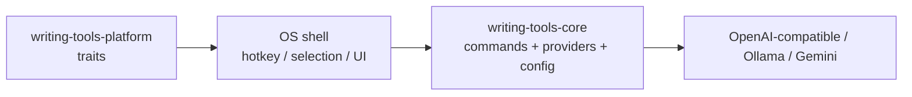

# writing-tools-rs

Cross-platform **Writing Tools**-style assistant: a Rust core for LLM writing commands, plus thin OS shells for hotkeys and text selection.

Inspired by [theJayTea/WritingTools](https://github.com/theJayTea/WritingTools). This is a clean-room architecture spike, not a line-for-line port. Original prompts and code.

## Layout



| Crate | Role |
| --- | --- |
| `crates/writing-tools-core` | Commands, config, providers |
| `crates/writing-tools-platform` | Traits for selection / hotkey / clipboard (+ null backend) |
| `apps/writing-tools` | CLI shell (desktop UI comes next) |

## Quick start

```bash
cargo run -p writing-tools -- init
export WRITING_TOOLS_API_KEY=sk-...   # or ollama / whatever your provider needs
cargo run -p writing-tools -- run proofread --text "Their going to the store tommorow."
```

Ollama example: edit `~/.config/writing-tools/config.toml`:

```toml
[provider]
kind = "ollama"
base_url = "http://localhost:11434/v1"
model = "llama3.1:8b"
api_key = "ollama"
```

```bash
cargo run -p writing-tools -- list-commands
cargo run -p writing-tools -- run summary --text "$(pbpaste)"
```

## Status

**Done:** workspace builds, config, builtin commands, OpenAI-compatible + Gemini providers, CLI `run`.

**Next:**

1. macOS shell: global hotkey + Accessibility selection replace
2. Response popup UI (summary / chat)
3. Windows / Linux shells implementing the same platform traits
4. Tray + settings UI (Tauri or native)

## License

MIT
