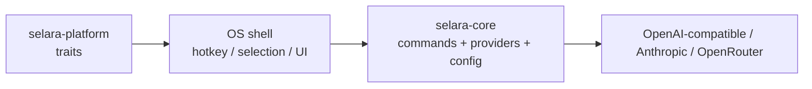

# Selara

Cross-platform **Selara** writing assistant: a Rust core for LLM writing commands, plus thin OS shells for hotkeys and text selection.

GitHub: [`snowopsdev/selara`](https://github.com/snowopsdev/selara).

Inspired by [theJayTea/WritingTools](https://github.com/theJayTea/WritingTools). This is a clean-room architecture spike, not a line-for-line port.

## Layout



| Crate | Role |
| --- | --- |
| `crates/selara-core` | Commands, config, providers |
| `crates/selara-platform` | Traits for selection / hotkey / clipboard (+ macOS backend) |
| `apps/selara` | CLI + macOS `serve` desktop shell |
| `apps/selara-desktop` | Tauri tray + Settings UI |

## Quick start (CLI)

```bash
cargo run -p selara -- init
export SELARA_API_KEY=sk-...   # or ollama / whatever your provider needs
cargo run -p selara -- run proofread --text "Their going to the store tommorow."
```

Providers (`~/.config/selara/config.toml`, or pick one in Settings):

| `kind` | Wire format | Default `base_url` |
|---|---|---|
| `open_ai_compatible` | OpenAI `/chat/completions` (OpenAI, Ollama, LM Studio, vLLM, ...) | `https://api.openai.com/v1` |
| `anthropic` | Anthropic Messages API | `https://api.anthropic.com` |
| `open_router` | OpenAI-compatible via OpenRouter | `https://openrouter.ai/api/v1` |

Leave `base_url` empty to use the default. Old configs with `kind = "ollama"` still load as `open_ai_compatible`.

Anthropic example:

```toml
[provider]
kind = "anthropic"
base_url = ""
model = "claude-opus-5"
```

Ollama example:

```toml
[provider]
kind = "open_ai_compatible"
base_url = "http://localhost:11434/v1"
model = "llama3.1:8b"
api_key = "ollama"
```

```bash
cargo run -p selara -- list-commands
cargo run -p selara -- run summary --text "$(pbpaste)"
```

## Config

Default path: `~/.config/selara/config.toml`.

- Override directory: `SELARA_CONFIG_DIR` (falls back to legacy `WRITING_TOOLS_CONFIG_DIR`)
- API key env: `SELARA_API_KEY` (falls back to legacy `WRITING_TOOLS_API_KEY`)
- **Migration:** on first load, if the Selara config is missing but `~/.config/writing-tools/config.toml` exists, it is copied into the Selara path (one-time message printed).

Codex / ChatGPT auth paths (`~/.codex`) are unchanged.

## macOS desktop shell (`serve`)

The `serve` subcommand registers a global hotkey, reads the current text selection via Accessibility (with a clipboard fallback), shows a small command picker, then either **replaces** the selection or shows a **popup** for summary / key points / table.

### First-use steps

1. **Init config** (once):

   ```bash
   cargo run -p selara -- init
   ```

2. **Set an API key** (env preferred):

   ```bash
   export SELARA_API_KEY=sk-...
   ```

   Or put `provider.api_key` in `~/.config/selara/config.toml`.

3. **Grant Accessibility**:

   - System Settings → Privacy & Security → Accessibility
   - Enable **Terminal** (if you `cargo run` from Terminal), **iTerm**, or the `selara` binary itself
   - macOS may prompt on first launch; you can also trigger the prompt by starting `serve`

4. **Start the shell**:

   ```bash
   cargo run -p selara -- serve
   ```

5. Select text in TextEdit / Notes / etc., press the hotkey, pick **Proofread** (or another command).

### Hotkey

Default hotkey is **`ctrl+shift+space`** (Control+Shift+Space). Plain `ctrl+space` often conflicts with macOS Input Sources / Spotlight, so the default avoids it.

Override in `~/.config/selara/config.toml`:

```toml
hotkey = "option+space"
# or: "cmd+shift+w", "ctrl+shift+space", …
```

Supported tokens: `ctrl`/`control`, `shift`, `alt`/`option`, `cmd`/`command`/`super`, plus a key (`space`, `a`–`z`, `0`–`9`, `enter`, `tab`, `escape`).

### Replace strategy (limitations)

1. Prefer Accessibility `AXSelectedText` set when the focused element supports it.
2. Fallback: save clipboard → set result → **⌘V** → restore clipboard after ~350ms.

**Known limitations**

- Clipboard restore can race if you copy something else during that window.
- Some apps (Electron, browsers, certain rich-text fields) ignore AX setValue; paste fallback usually still works if the original selection remains.
- The picker steals focus; Selara re-activates the previous app before replace.
- Global hotkeys need the `serve` process running (no LaunchAgent yet).
- Hotkey conflicts: if registration fails or nothing fires, pick another chord in config.

## Desktop Settings (Tauri, macOS)

Menu-bar app for Settings — no text selection required. The egui `serve` overlay still owns the hotkey picker for now.

```bash
cargo run -p selara-desktop
```

Tray: Open Settings (or left-click the icon). Close hides Settings; Quit exits.

Sections: General, Models (BYOK or ChatGPT via Codex), Commands, Limits. Config: `~/.config/selara/config.toml`.

## Status

**Done:** workspace builds, config, builtin commands, OpenAI-compatible + Anthropic + OpenRouter providers (with model discovery in Settings), CLI `init` / `list-commands` / `run`, macOS `serve` (hotkey + picker + replace/popup), Tauri Settings tray.

**Next:**

1. LaunchAgent / menu-bar stay-resident polish
2. Windows / Linux shells implementing the same platform traits

## Contributing / security / license

- [CONTRIBUTING.md](CONTRIBUTING.md) — start here: clone → test → PR
- [SECURITY.md](SECURITY.md) — how we handle security
- [Report a vulnerability](https://github.com/snowopsdev/selara/security/advisories/new) — private GitHub Security Advisory (preferred)
- [CODE_OF_CONDUCT.md](CODE_OF_CONDUCT.md) — Contributor Covenant 2.1
- [LICENSE](LICENSE) — MIT

CI runs on Linux. macOS Accessibility, global hotkeys, `serve`, and Tauri UI still need local macOS testing when those areas change.

Open Settings UI on macOS: `cargo run -p selara-desktop`.
