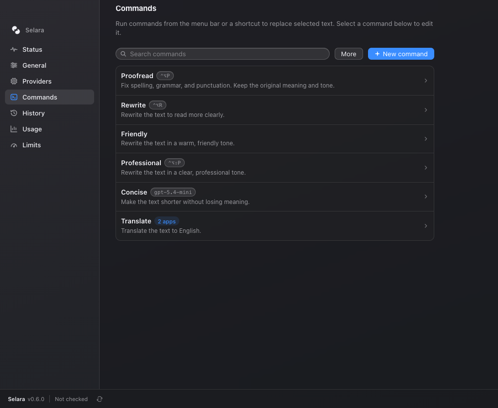
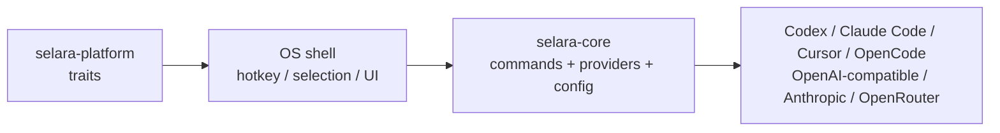
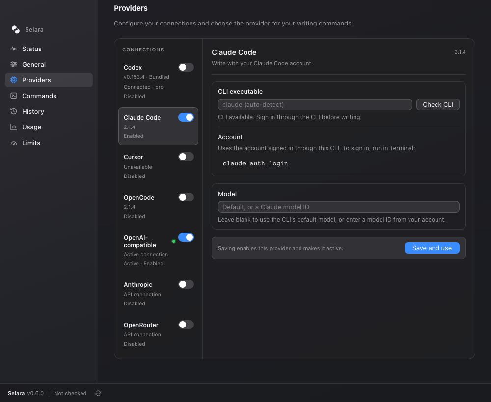
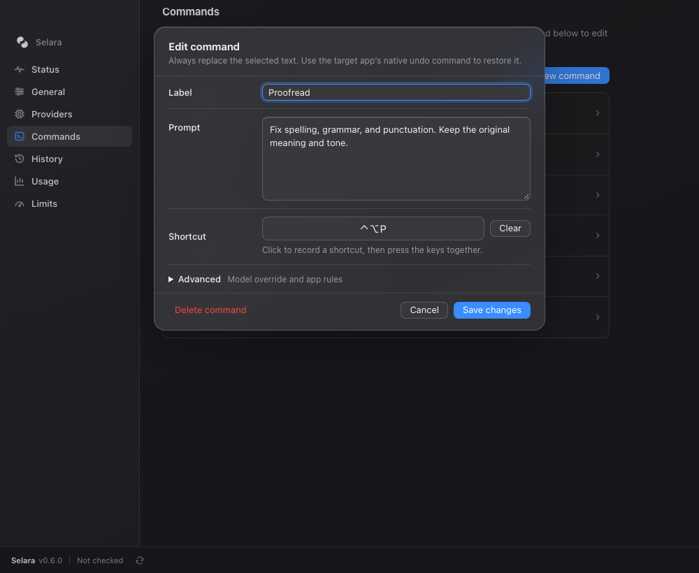
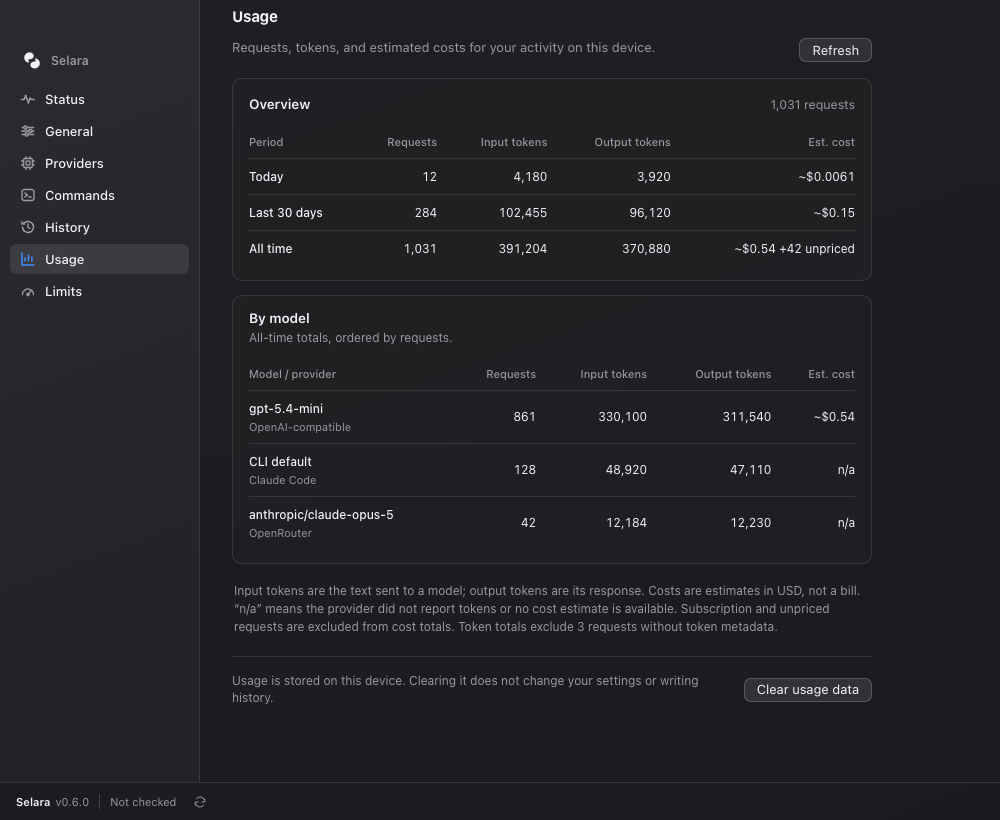

# Selara

[](https://github.com/snowopsdev/selara/actions/workflows/ci.yml)
[](LICENSE)

Select text in any app, press a hotkey, and rewrite it with the LLM of your choice.

Selara is a writing assistant for macOS built on a Rust core. It reads your current selection, runs it through a prompt you control, and replaces the selected text with the completed result. Use your ChatGPT account through the bundled Codex runtime, connect Claude Code, Cursor, or OpenCode, or bring an API key for OpenAI-compatible endpoints, Anthropic, or OpenRouter. Local servers such as Ollama and LM Studio work too.

<p align="center">
  
</p>

Inspired by [theJayTea/WritingTools](https://github.com/theJayTea/WritingTools). Selara is a clean-room architecture, not a port.

## Features

- **Works wherever text is selected.** A global hotkey (default `ctrl+shift+space`) opens the custom-instruction dialog. Configured commands are available from the menu bar and their own shortcuts. Selara reads a nonempty selection through macOS Accessibility and writes the finished result back over that selection.
- **Selection stays explicit.** If no text is selected, Selara shows **Select text first** and does not send a request or paste stale clipboard contents. Clipboard-assisted capture is used only when fresh copied text and the original target can both be verified.
- **Free-form instruction.** The custom-instruction hotkey opens a small dialog for a one-off instruction. The dialog recalls the last ten instructions (↑ in the empty field) and offers **Save as command…** so useful instructions can be added to the menu bar.
- **Every command replaces the selection.** Proofread, Rewrite, Friendly, Professional, Concise, Summary, Key Points, Table, Translate, and custom commands all write the completed result over the selection while retaining formatting requested by the prompt.
- **Native command feedback.** A transparent working orb appears beside the editor near your selection while the model runs. Hover to reveal Cancel, or press Escape. Selara performs one replacement after the full response arrives and shows a brief checkmark when it verifies the edit.
- **Your prompts.** Every command is a labeled prompt. Edit the built-ins, add your own, duplicate one to make a variation, and search the list. Prompts can use `{{language}}` (your preferred language) and `{{app}}` (the app the selection came from); the built-in **Translate** command is `Translate the text to {{language}}`.
- **Record command shortcuts.** Click the shortcut control and press your chosen keys together. Selara captures the combination, checks for conflicts, and pauses its own shortcuts while recording. After saving, the shortcut runs the command on the current selection. Large or secret-shaped selections still require confirmation.
- **Excluded apps.** List password managers, terminals, or anything else by name or bundle id and the hotkeys do nothing there: no command, selection, or clipboard read.
- **Native undo and cancel.** Pressing Escape while a command is running discards its result instead of replacing anything. After a replacement, use the target app's native ⌘Z to restore the original text.
- **History and recovery.** The last 50 completed rewrites are kept locally with their original text, command, app, and replacement outcome. If Selara cannot apply or verify an edit, the result stays in History with copy controls, without opening a result popup or retrying an uncertain paste.
- **Provider connections.** A dedicated Providers screen brings Codex, Claude Code, Cursor, OpenCode, OpenAI-compatible APIs, Anthropic, and OpenRouter together. View CLI versions, keep each connection's settings, enable or disable connections, and choose which one your commands use.
- **API model discovery.** Load the model list straight from the provider. A bad key or URL shows up right there, so it doubles as a connection test.
- **ChatGPT via Codex (experimental).** Reuse your existing ChatGPT login through a bundled native writing runtime. Credentials stay in Codex’s file or Keychain store; no separate Codex installation or Node is required.
- **Size limits.** A soft warning, a replacement caution, and a hard maximum, so a stray select-all never sends 100k characters to a metered API. They apply to menu, custom-instruction, and shortcut runs alike.
- **Secret guard.** If the selection looks like it holds an API key, a private key block, a JWT, or a card number, Selara asks before sending it to a hosted provider; local servers are exempt.
- **Live config.** Everything lives in one TOML file. The `serve` process watches the config directory for changes and re-registers hotkeys as soon as the Settings app saves (with a 5-second poll as a fallback), while staying idle otherwise.
- **Menu-bar Settings app.** A Tauri tray app with Status, General, Providers, Commands, History, Usage, and Limits tabs. A single-line footer keeps the app version and update controls on the left and reports problems on the right. No Dock icon, closes to the tray.
- **Local usage and cost.** The Usage tab and `selara usage` show requests and reported token counts for today, the last 30 days, and all time, plus a breakdown by model and provider. Costs are estimates for known models on their vendor's API; subscription, local, and custom endpoints remain unpriced. The ledger stays on your device.
- **Scriptable CLI.** `selara init`, `selara list-commands`, `selara run <command>`, `selara usage`, and `selara key set|clear|status` for pipelines and quick checks.
- **Keys in the keychain.** API keys go into the OS credential store (macOS Keychain) by default; `config.toml` stays free of secrets unless you choose otherwise.

## How it works



| Crate | Role |
| --- | --- |
| `crates/selara-core` | Commands, config, providers |
| `crates/selara-platform` | Traits for selection / hotkey / clipboard (+ macOS backend) |
| `apps/selara` | CLI + macOS `serve` desktop shell |
| `apps/selara-desktop` | Tauri tray + Settings UI |

The `serve` shell registers the custom-instruction and command hotkeys, builds the menu-bar command list, reads the current selection, sends `{prompt, selection}` to the configured provider, and replaces the selection only after a complete successful response. The Settings app edits the same config file.

## Install (macOS)

Every GitHub Release ships a `Selara-<version>-macos-arm64.dmg` (the menu-bar app), a `selara-<version>-macos-arm64.tar.gz` (the CLI), and Homebrew files. With the tap configured:

```bash
brew tap snowopsdev/selara
brew install --cask selara      # menu-bar app
brew install selara             # CLI
```

Until the release is signed and notarized by Apple, macOS may report the app as damaged on first launch; clear the quarantine flag with `xattr -d com.apple.quarantine /Applications/Selara.app`. Only verified notarized releases remove this caveat. The first upgrade from v0.4.1 must be installed manually; see [release and update recovery](docs/release-updater.md). Building from source is described next.

## Quick start (macOS)

Building from source requires Rust 1.95 or newer and Xcode command-line tools, including Swift. The Settings app also needs Node.js. See [CONTRIBUTING.md](CONTRIBUTING.md) for full setup and platform requirements.

1. **Create the config** (once):

   ```bash
   cargo run -p selara -- init
   ```

2. **Choose a connection.** Open **Settings → Providers** to sign in with ChatGPT, select an installed CLI, or configure an API/local connection. Claude Code, Cursor, and OpenCode must be installed and signed in separately. For an API connection, store its key in the OS keychain (macOS Keychain):

   ```bash
   echo -n sk-... | cargo run -p selara -- key set
   ```

   Or export `SELARA_API_KEY`, which takes precedence for API connections, or paste the key into Providers, where "Store in the OS keychain" is on by default. Local servers such as Ollama accept any placeholder key. Lookup order is environment, keychain, then `provider.api_key` in `config.toml`. Codex and external CLI connections use their own account stores. macOS may ask for Keychain access again after a development rebuild.

3. **Grant Accessibility.** System Settings → Privacy & Security → Accessibility, then enable Terminal or iTerm (whichever runs `cargo run`) or the `selara` binary itself. macOS may prompt on first launch, and starting `serve` also triggers the prompt.

4. **Start the shell.** The Settings app (next section) starts `serve` for you, restarts it if it crashes, and can start at login (General → Start at login). From a terminal it also works on its own:

   ```bash
   cargo run -p selara -- serve
   ```

   The app never starts a second copy while one is running elsewhere. Accessibility must be granted to whatever runs `serve`: the app bundle when it is managed, or the terminal / sidecar binary under `apps/selara-desktop/src-tauri/binaries/` during `tauri dev`.

5. Select text in TextEdit, Notes, Mail, or anywhere else, then choose a command from the Selara menu bar. You can also assign a command shortcut in Settings, or press `ctrl+shift+space` to enter a custom instruction.

To open the Settings app:

```bash
cd apps/selara-desktop && npx tauri dev
```

It lives in the menu bar. Left-click the icon (or choose **Open Settings**) to show the window. Closing the window hides it. **Quit** exits.

Use the Tauri command rather than `cargo run -p selara-desktop`. A debug build loads the Vite dev server that `tauri dev` starts for it, so running the binary alone opens a blank window.

Orca worktree setup copies ignored `.env` and `.env.*` files from the main checkout, preserving any files already in the new worktree. For a worktree created with `git worktree add`, run `python3 scripts/copy-worktree-env.py` from its root. This is a one-time local copy; see [worktree environment files](CONTRIBUTING.md#worktree-environment-files).

## Settings app tour

Settings changes are saved to the same `config.toml`. General and Limits save each field as soon as you press Return or leave it, the way System Settings does; Providers and the command editor save with their buttons. If `serve` is running, saved changes apply within about a second. Right-click a command or History entry for its actions, and use ↑/↓ to move between tabs in the sidebar.

### Status

The tab the app opens on. Four cards show whether everything is ready:

- **selara serve**: whether the shell is running, with its pid. `serve` writes `serve.pid` next to the config file while it runs and removes it on exit; **Troubleshooting** on the card shows that path and the Terminal command to run it yourself.
- **Accessibility**: the grant reported by Selara's managed `serve` process, with an **Open Accessibility settings** button when needed. A process started outside Settings reports unknown trust; restart it under Settings management to inspect its grant.
- **Provider**: the saved connection, model, endpoint or executable, and auth mode. **Check connection** lists API models, checks the Codex sign-in, or checks an external CLI's version. CLI version checks do not establish account or model access. The API key is never displayed.
- **Shortcuts**: the custom-instruction hotkey and every command that has its own shortcut.

**Refresh** re-reads the config and re-runs the checks. Usage has its own tab.

### App version and updates

The footer spans the whole window on every tab. The left side shows the installed version, update state, and a button to check for updates. When a release is available, **Install and restart** appears there. Download progress and expandable details keep update errors and release notes accessible. The right side stays empty unless something goes wrong, such as a failed save; routine updates like **Saved** are announced to VoiceOver without taking space. Development builds may have automatic updates disabled.

### General

The global shortcut that opens the custom-instruction dialog, plus a preferred language code. The language fills `{{language}}` in prompts and is added to every prompt as a hint: the model replies in that language unless the command itself names an output language (a "Translate to French" command wins) or the selected text is clearly written in another one, in which case it keeps the text's language.

**Excluded apps** lists apps where the hotkeys should do nothing, one per line, by localized name (`1Password`) or bundle id (`com.apple.Terminal`), matched case-insensitively. End an entry with `*` to match a prefix (`com.apple.*`, `iTerm*`). When the frontmost app is on the list, `serve` logs the ignored press and neither opens a window nor reads the selection or clipboard.

### Providers

Choose a connection from the list to see its account, model, and configuration. The list shows each installed CLI's version and identifies the active connection. **Save and use** saves the selected connection, enables it, and makes it active for writing commands. A failed save keeps your draft and shows an error beside the button.

Each connection has an **enable/disable switch** that saves immediately and retains its settings. Disabling the active connection stops new writing requests after config reload; it does not cancel a request already running or select a fallback. Enabling a different connection does not make it active until you choose **Save and use**. Selara keeps one saved configuration per provider and authentication mode; multiple named instances of the same connection are not supported yet.



**Codex** uses the bundled native writing runtime with your ChatGPT account (experimental). Sign in through the browser and refresh the model list to choose a model available to your account. The account address is masked by default. No separate Codex installation or Node runtime is needed. **Advanced** holds the optional shared Codex home path.

**Claude Code, Cursor, and OpenCode** use the account signed in through their installed CLI. Leave **CLI executable** blank for discovery, or enter a command name or absolute path. **Check CLI** verifies installation and reports the version; authentication and model access are checked when a writing command runs. Leave the model blank for the CLI default; OpenCode overrides use `provider/model` IDs.

Automatic discovery looks for `claude`, `cursor-agent`, and `opencode`. If your Cursor installation uses a different executable name, select that executable explicitly.

Cursor uses read-only ask mode with writing tools denied, but its configured local and team hooks still apply and may process the submitted text. OpenCode uses its authentication adapters without external plugins, skills, or custom endpoint configuration.

**OpenAI-compatible, Anthropic, and OpenRouter** use API keys. Type a model ID or press **Load models** to fetch the provider's list. For OpenAI-compatible connections, a **Preset** fills the base URL and key hint for OpenAI, Ollama, LM Studio, vLLM, Groq, Mistral, Gemini, Together, or DeepSeek; choose **Custom endpoint** for anything else. Model loading reports a connection error if the key or URL is wrong.

### Commands

The list of prompts available from the Selara menu bar. Every command replaces the current selection, and rows show a command shortcut when one is configured. Search filters the list. Hover or focus a row to duplicate or delete it. **More** opens the command-pack controls: **Export…** saves every command as a TOML pack (`[[commands]]` tables, the same shape as `config.toml`), and **Import…** merges a TOML or JSON pack back in. Choose how to handle existing command IDs before importing: keep both under a new ID, replace yours, or skip. Imported hotkeys that are already taken are dropped rather than duplicated.

Click a row to edit it. The editor holds the label, prompt, and optional shortcut. **Advanced** contains the optional model override and app rules. The model override uses the same provider and key. Every saved command uses replacement behavior. Save and Cancel stay visible while the form scrolls; `⌘↩` saves and Escape closes the editor when no save is pending. A failed save keeps your draft open with an error and **Retry save**. The list changes only after a successful save.

To assign a shortcut, click **Record shortcut** (or the current combination), then press and release the keys together. Escape cancels recording without closing the editor; **Clear** removes the assignment. Save the command to apply it. Selara pauses its shortcuts during recording and restores them when recording ends or Settings loses focus. Conflicts with other commands or the custom-instruction shortcut are identified before saving. Standard copy, cut, paste, undo, and redo shortcuts are reserved.



**Apps** narrows a command to the apps it belongs in: a menu action or shortcut is ignored outside those apps. The field is comma-separated app names or bundle ids (a trailing `*` matches by prefix), and leaving it empty — the default for every built-in command — offers the command everywhere. Custom instructions follow the global excluded-app rules.

```toml
[[commands]]
id = "reply"
label = "Draft reply"
kind = "replace"
prompt = "Draft a short reply to this message."
apps = ["Mail", "com.apple.Notes"]
```

### History

Each completed rewrite produced while `serve` runs is recorded: the time, the command, the app the selection came from, a preview of the original text and the result, and a **Copy** button that puts the result back on the clipboard. Its arrow, or right-clicking the entry, offers **Copy Result** and **Copy Original**. **Clear history** deletes the whole list after a native confirmation. Historical records from older releases remain readable.

**Not applied** means the completed result did not reach the paste step. **Paste unverified** means a paste was attempted but Selara could not confirm the edit; check your document before copying that result. Selara keeps these results available without interrupting you with a popup or automatically retrying an uncertain paste.

Restoring is a clipboard copy on purpose: putting text back into the source app needs that app's focus and Accessibility, which the Settings window does not have. To restore a replacement in the source app, use that app's native ⌘Z.

Privacy: the list lives in `history.jsonl` in the config directory (`~/.config/selara/` by default), is kept readable only by you (mode 0600, re-applied on every append), holds the selected text and the results verbatim, and is trimmed to the newest 50 entries. Clear it from the tab, or delete the file, if you would rather not keep it around.

### Usage

Usage has its own navigation item. **Overview** shows requests, input tokens, output tokens, and estimated cost for today (your local calendar day), the last 30 days, and all time. **By model** groups all-time activity by model and provider, ordered by request count.

Token counts depend on what the provider reports; missing metadata is identified instead of counted as zero. Costs are estimates in USD for known models on their vendor's own API, not a bill. Subscription requests and unpriced endpoints are excluded from cost totals and shown as **n/a** when no estimate is available.

**Refresh** reloads the local ledger. **Clear usage data** clears `usage.jsonl` without changing settings or writing history. Usage data is stored beside the config and is never sent elsewhere by Selara.



The current Providers, Commands, shortcut-recorder, and Usage screenshots use example data.

### Limits

Guard rails for large selections. Changes save as soon as you press Return or leave a field; **Reset to Defaults** restores the standard values. Set any value to `0` to disable the corresponding warning. The soft warn, replacement caution, and secret guard are compact confirmations shown before a request or replacement. A command is never sent past the hard maximum.

| Setting | Default | Effect |
| --- | --- | --- |
| Soft warn | 8000 chars | Ask before sending a large selection |
| Hard max | 100000 chars | Refuse anything larger |
| Replace caution | 4000 chars | Ask again before overwriting a large selection |
| Secret guard | on | Ask before sending secret-shaped text (API keys, private keys, JWTs, card numbers) to a hosted provider; local servers (`localhost`, `.local`, private IPs) are exempt |

## Providers and config

Default config path: `~/.config/selara/config.toml`. The file is written atomically (temp file + rename) with owner-only permissions (`0600`), and the Settings app saves one tab at a time, so saving one section preserves changes to other sections and commands saved from the instruction dialog. A `schema_version` key records the file format (currently `2`); versionless files are read as version 1 and migrated in memory. Legacy popup commands are normalized to replacement behavior while command ids, prompts, models, app filters, and valid shortcuts are preserved.

| `kind` | Wire format | Default `base_url` |
|---|---|---|
| `open_ai_compatible` | OpenAI `/chat/completions` (OpenAI, Ollama, LM Studio, vLLM, ...) | `https://api.openai.com/v1` |
| `anthropic` | Anthropic Messages API | `https://api.anthropic.com` |
| `open_router` | OpenAI-compatible via OpenRouter | `https://openrouter.ai/api/v1` |
| `claude_cli` | Installed Claude Code CLI | Not used |
| `cursor_cli` | Installed Cursor Agent CLI | Not used |
| `open_code_cli` | Installed OpenCode CLI | Not used |

For API providers, leave `base_url` empty to use the default. Old configs with `kind = "ollama"` still load as `open_ai_compatible`. Codex uses `kind = "open_ai_compatible"` with `auth = "chatgpt"` and ignores `base_url`.

`[provider]` is the active connection. `enabled` defaults to `true` for existing configurations. Settings retains other connections in `provider_connections`, keyed by kind and auth mode, so changing the active connection does not discard their saved settings.

Prompt placeholders: `{{language}}` expands to the configured language and `{{app}}` to the name of the app the selection came from (CLI runs use "the current application"). Unknown placeholders are left as written; the selected text itself is always sent as the message, so it needs no placeholder. Configs that list their own `commands` do not gain the new built-in **Translate** command automatically; add a command with the prompt `Translate the text to {{language}}. Return only the translation.` to get it.

Anthropic:

```toml
[provider]
kind = "anthropic"
base_url = ""
model = "claude-opus-5"
```

Ollama:

```toml
[provider]
kind = "open_ai_compatible"
base_url = "http://localhost:11434/v1"
model = "llama3.1:8b"
api_key = "ollama"
```

Environment and paths:

- `SELARA_CONFIG_DIR` overrides the config directory (falls back to the legacy `WRITING_TOOLS_CONFIG_DIR`).
- For API connections, `SELARA_API_KEY` takes precedence (falls back to the legacy `WRITING_TOOLS_API_KEY`); next comes the OS keychain entry (`selara key set|clear|status`, service `dev.snowops.selara`), then `provider.api_key`. Codex and external CLI adapters use their own authentication stores.
- `selara --config <path>` overrides the file for a single CLI invocation.
- **Migration:** on first load, if the Selara config is missing but `~/.config/writing-tools/config.toml` exists, it is copied into the Selara path (a one-time message is printed).
- ChatGPT via Codex uses the bundled native writing runtime. Set an absolute `provider.codex_home` in Settings if your shared login is outside `~/.codex`; it takes precedence over `CODEX_HOME`. Remove legacy `CODEX_BIN` and `CODEX_AUTH_JSON` overrides. Signing out affects that shared Codex home, including other Codex clients.

Claude Code example (Cursor and OpenCode use `cursor_cli` and `open_code_cli` respectively):

```toml
[provider]
kind = "claude_cli"
enabled = true
base_url = ""
model = "" # Use the CLI's default model.
# cli_binary = "/absolute/path/to/claude" # Optional; otherwise discovered.
```

## The `serve` shell in detail

### Hotkey

The custom-instruction shortcut defaults to `ctrl+shift+space`. Plain `ctrl+space` often conflicts with macOS Input Sources and Spotlight, so the default avoids it. Override it in the General tab or in config:

```toml
hotkey = "option+space"
# or: "cmd+shift+w", "ctrl+shift+space", …
excluded_apps = ["1Password", "com.apple.Terminal"]   # optional; hotkeys are ignored in these apps
```

Supported tokens: `ctrl`/`control`, `shift`, `alt`/`option`, `cmd`/`command`/`super`, plus a key: `space`, `a`–`z`, `0`–`9`, `enter`, `tab`, `escape`; function keys `f1`–`f12`; arrows `up`/`down`/`left`/`right`; editing keys `backspace`, `delete`, `home`, `end`, `pageup`, `pagedown`; and the punctuation characters `-` `=` `[` `]` `;` `'` `,` `.` `/` `` ` `` `\`. Tokens are case-insensitive and may be padded with spaces. The same grammar applies to per-command hotkeys.

### Replace strategy

Selara captures the actual nonempty selection and its source application before opening any confirmation or progress UI. After a complete provider response, it revalidates the original app, window, element, and selection before using the source app's normal paste operation once. If Selara's own UI holds focus, it can return focus to the source app. It does not paste while an unrelated app is frontmost. A changed or unverifiable target is rejected before pasting. If the paste itself cannot be verified, the result is marked in History and is not retried. Use the source app's native ⌘Z to undo an applied replacement.

### Known limitations

- The paste fallback snapshots the whole pasteboard (every type, images included) and only restores it if nothing else was copied in between, so a copy you make during that window wins and the pre-Selara clipboard is dropped.
- Some apps (Electron, browsers, certain rich-text fields) do not expose a stable selection or consume paste slowly. Selara refuses an unverified replacement and never retries an uncertain paste automatically.
- While a command runs, a transparent working orb appears beside the editor near the selection. If editor bounds are unavailable, it appears offset from the selection or the cursor position captured when the command started. Hover over the orb to reveal its cancel button, or press Escape. A brief checkmark appears only after verified replacement. The orb uses the SwiftUI [ThinkingOrbsKit](apps/selara/native/ThinkingOrbsKit/UPSTREAM.md) working animation on macOS 12+; macOS 11 uses a native spinner. Try the [standalone preview](examples/native-progress-preview.md) without running a writing command.
- If replacement cannot be verified, Selara saves the completed rewrite in **Settings → History** without opening a dialog or retrying the paste. Entries marked **Not applied** did not reach the paste step; for **Paste unverified**, check your document before copying the saved result.
- Global hotkeys need the `serve` process running. The Settings app keeps it running and can register itself as a login item; a bare terminal `serve` still stops when the terminal closes.
- If a hotkey fails to register or never fires, pick another chord.

## CLI

```bash
cargo run -p selara -- init
cargo run -p selara -- list-commands
cargo run -p selara -- run proofread --text "Their going to the store tommorow."
cargo run -p selara -- run summary --text "$(pbpaste)"
```

`run` reads stdin when `--text` is omitted, returns the completed result on stdout, and `--instruct` appends a one-off instruction to the command's prompt. `--no-stream` is accepted for compatibility. `selara usage` prints the local usage ledger as a table (tokens in/out per window and per model, with estimated costs).

## Status

**Available:** configurable writing commands, recorded shortcuts, Codex and external CLI connections, API/local providers, native command progress, History with replacement outcomes, a dedicated Usage view, and version/update controls available throughout Settings. The Settings app manages `serve`, supports starting at login, and reloads saved configuration.

**Next:**

Windows and Linux desktop shells implementing the same platform traits. The portable core and CLI are already covered by Linux CI.

## Contributing, security, license

- [CONTRIBUTING.md](CONTRIBUTING.md) — clone → test → PR
- [SECURITY.md](SECURITY.md) — how we handle security
- [Report a vulnerability](https://github.com/snowopsdev/selara/security/advisories/new) — private GitHub Security Advisory (preferred)
- [CODE_OF_CONDUCT.md](CODE_OF_CONDUCT.md) — Contributor Covenant 2.1
- [LICENSE](LICENSE) — MIT

CI runs tests on Linux and compiles the macOS shell on `macos-latest`. macOS Accessibility, global hotkeys, `serve`, and the Tauri UI still need local macOS testing when those areas change.
