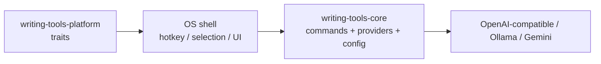

# writing-tools-rs

Cross-platform **Writing Tools**-style assistant: a Rust core for LLM writing commands, plus thin OS shells for hotkeys and text selection.

Inspired by [theJayTea/WritingTools](https://github.com/theJayTea/WritingTools). This is a clean-room architecture spike, not a line-for-line port. Original prompts and code.

## Layout



| Crate | Role |
| --- | --- |
| `crates/writing-tools-core` | Commands, config, providers |
| `crates/writing-tools-platform` | Traits for selection / hotkey / clipboard (+ macOS backend) |
| `apps/writing-tools` | CLI + macOS `serve` desktop shell |

## Quick start (CLI)

```bash
cargo run -p writing-tools -- init
export WRITING_TOOLS_API_KEY=sk-...   # or ollama / whatever your provider needs
cargo run -p writing-tools -- run proofread --text "Their going to the store tommorow."
```

Ollama example: edit `~/.config/writing-tools/config.toml`:

```toml
[provider]
kind = "ollama"
base_url = "http://localhost:11434/v1"
model = "llama3.1:8b"
api_key = "ollama"
```

```bash
cargo run -p writing-tools -- list-commands
cargo run -p writing-tools -- run summary --text "$(pbpaste)"
```

## macOS desktop shell (`serve`)

The `serve` subcommand registers a global hotkey, reads the current text selection via Accessibility (with a clipboard fallback), shows a small command picker, then either **replaces** the selection or shows a **popup** for summary / key points / table.

### First-use steps

1. **Init config** (once):

   ```bash
   cargo run -p writing-tools -- init
   ```

2. **Set an API key** (env preferred):

   ```bash
   export WRITING_TOOLS_API_KEY=sk-...
   ```

   Or put `provider.api_key` in `~/.config/writing-tools/config.toml`.

3. **Grant Accessibility**:

   - System Settings → Privacy & Security → Accessibility
   - Enable **Terminal** (if you `cargo run` from Terminal), **iTerm**, or the `writing-tools` binary itself
   - macOS may prompt on first launch; you can also trigger the prompt by starting `serve`

4. **Start the shell**:

   ```bash
   cargo run -p writing-tools -- serve
   ```

5. Select text in TextEdit / Notes / etc., press the hotkey, pick **Proofread** (or another command).

### Hotkey

Default hotkey is **`ctrl+shift+space`** (Control+Shift+Space). Plain `ctrl+space` often conflicts with macOS Input Sources / Spotlight, so the default avoids it.

Override in `~/.config/writing-tools/config.toml`:

```toml
hotkey = "option+space"
# or: "cmd+shift+w", "ctrl+shift+space", …
```

Supported tokens: `ctrl`/`control`, `shift`, `alt`/`option`, `cmd`/`command`/`super`, plus a key (`space`, `a`–`z`, `0`–`9`, `enter`, `tab`, `escape`).

### Replace strategy (limitations)

1. Prefer Accessibility `AXSelectedText` set when the focused element supports it.
2. Fallback: save clipboard → set result → **⌘V** → restore clipboard after ~350ms.

**Known limitations**

- Clipboard restore can race if you copy something else during that window.
- Some apps (Electron, browsers, certain rich-text fields) ignore AX setValue; paste fallback usually still works if the original selection remains.
- The picker steals focus; Writing Tools re-activates the previous app before replace.
- Global hotkeys need the `serve` process running (no LaunchAgent yet).
- Hotkey conflicts: if registration fails or nothing fires, pick another chord in config.

## Status

**Done:** workspace builds, config, builtin commands, OpenAI-compatible + Gemini providers, CLI `init` / `list-commands` / `run`, macOS `serve` (hotkey + picker + replace/popup).

**Next:**

1. LaunchAgent / menu-bar stay-resident polish
2. Windows / Linux shells implementing the same platform traits
3. Tray + settings UI (Tauri or native)

## License

MIT

## Desktop Settings (Tauri, macOS)

Menu-bar app for Settings — no text selection required. The egui `serve` overlay still owns the hotkey picker for now.

```bash
cd apps/writing-tools-desktop
# install JS deps with your package manager, then:
npx vite --port 1420 --strictPort
# other terminal:
cargo run -p writing-tools-desktop
```

Tray: Open Settings (or left-click the icon). Close hides Settings; Quit exits.

Sections: General (language + hotkey), Models (API keys), Commands (CRUD + duplicate), Limits.

Config path: `~/.config/writing-tools/config.toml`.

