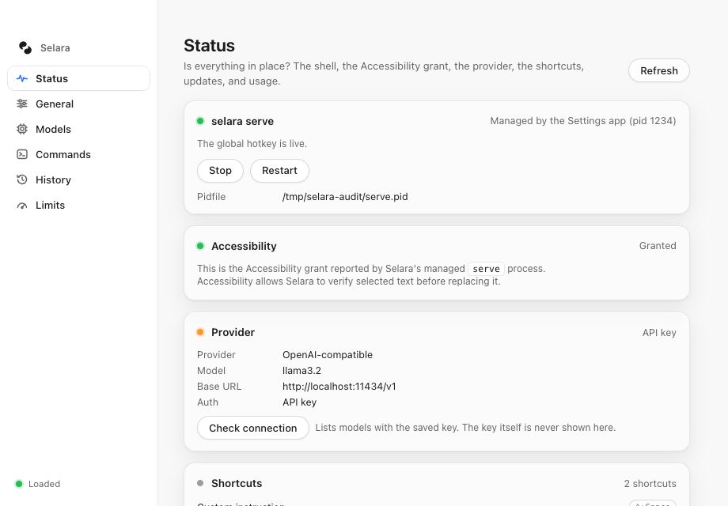
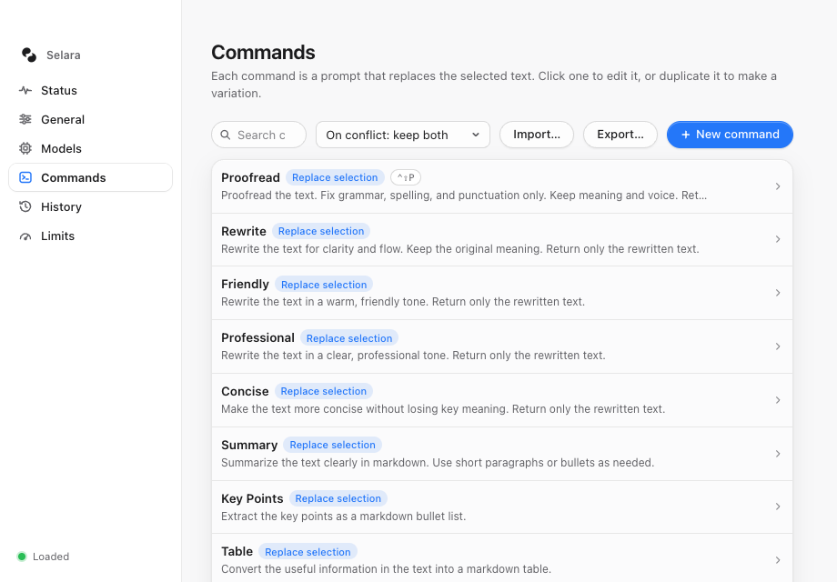
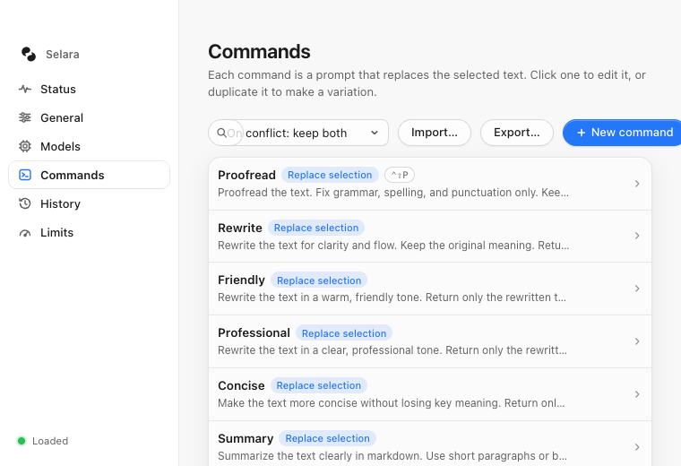
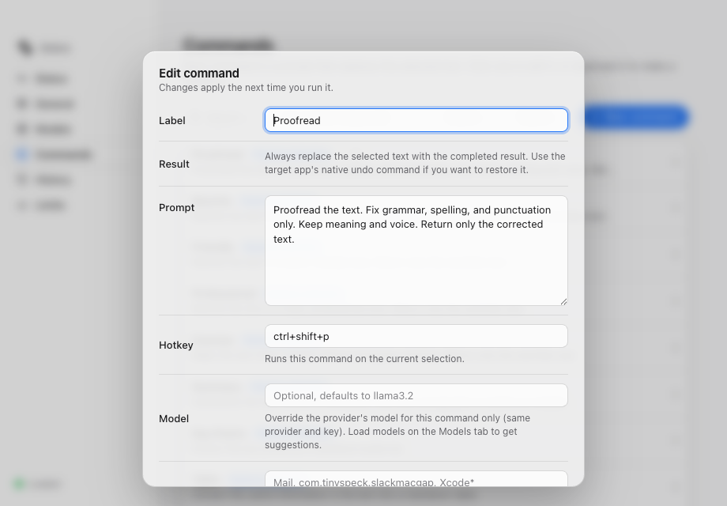
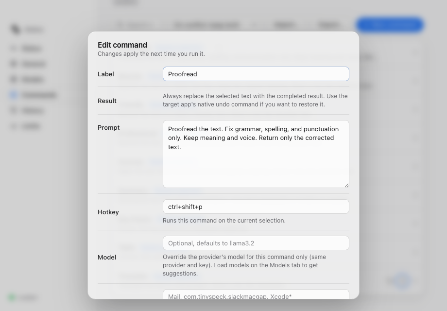
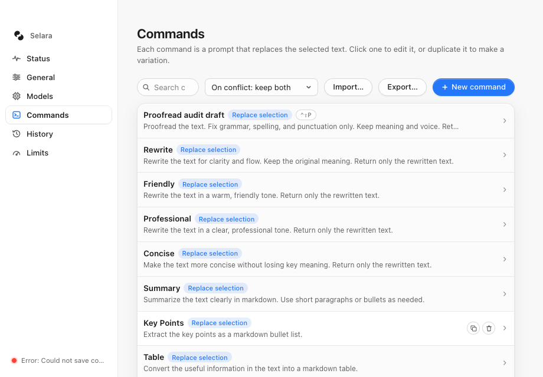
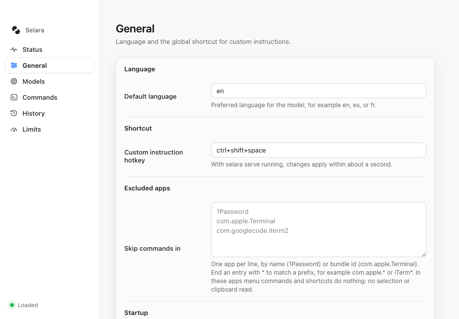
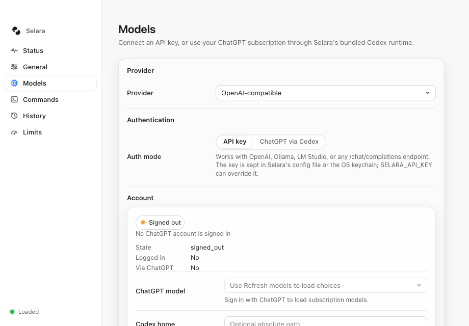
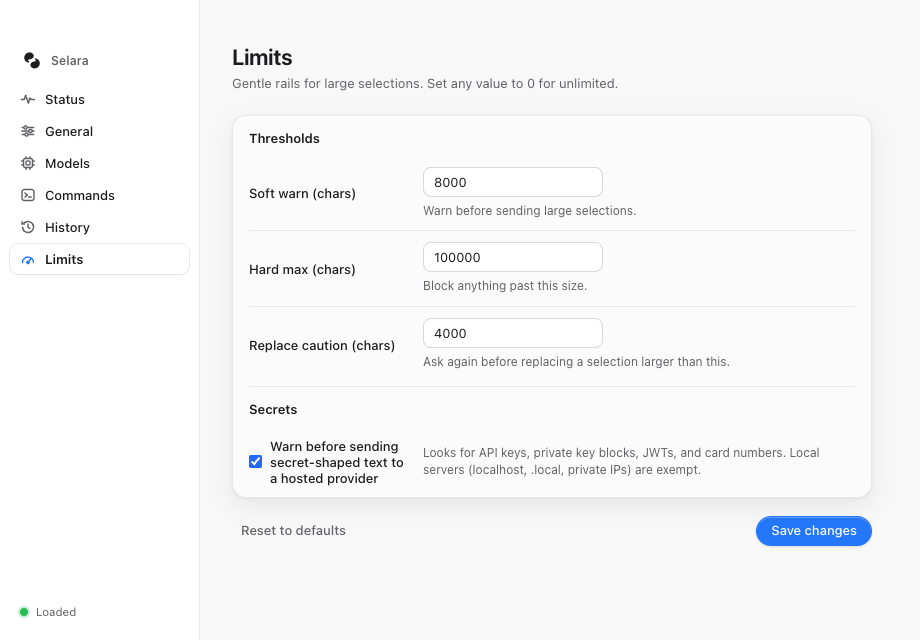
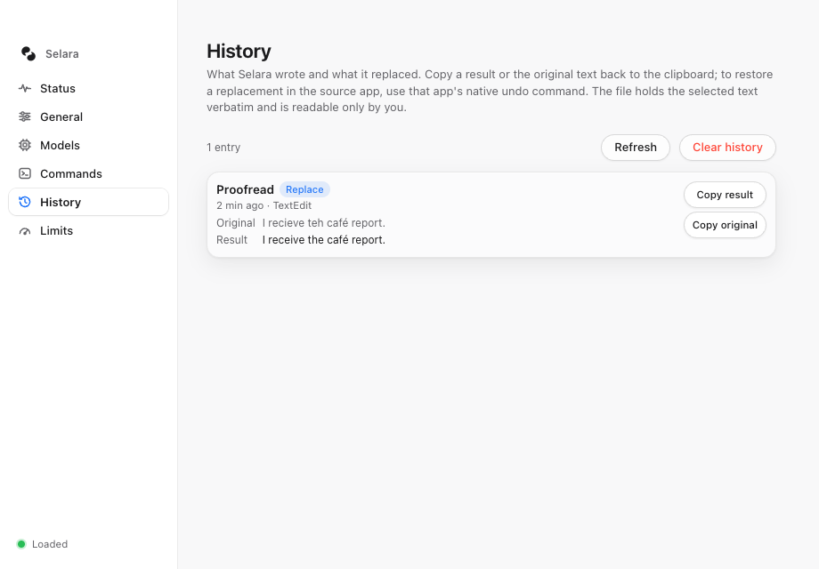

# Selara UI/UX audit — September 11, 2026

The first improvements should make command editing dependable, make the Commands toolbar fit the supported window sizes, and put the selected provider's setup fields first. The existing restrained styling and familiar sidebar are a useful foundation; the largest problems are behavior and information order.

## Implementation follow-up — September 12, 2026

Findings 1–5 below have been implemented: command save failures retain the draft and saved list; the editor contains and restores keyboard focus; the Commands toolbar fits both supported sizes; editor actions remain visible; and Models puts the active connection first while retaining shared-account controls. Provider drafts, key-storage choices, and save-error recovery have regression coverage. The following walkthrough records the original audit observations, not the updated interface.

The updated interface passed 51 Settings tests and browser checks at 920 × 640 and 760 × 520, with light and dark appearances. Current screenshots appear in the [README](../../../README.md#settings-app-tour). Findings 6–8 and the live native checks remain outstanding. See [picker removal validation](../../picker-removal-validation.md) for automated results and the release gate.

## Scope and evidence

This is a **Settings frontend audit with a supplementary source review of native command entry**, not a completed end-to-end macOS audit. Screenshots show the current working-tree `apps/selara-desktop/index.html` running in the in-app browser. A temporary local adapter supplied synthetic configuration, service, account, and history data. Navigation, forms, layout, and keyboard handling used the actual frontend code. The save-error scenario deliberately rejected the backend call.

Captured at 920 × 640 and the configured minimum 760 × 520, in light appearance. These are browser content viewports; the final Tauri webview, title bar, and native vibrancy need a separate check. All ten accepted screenshots were saved and visually inspected during this audit. Dark captures were rejected because the browser capture was cropped; they support no dark-mode findings. No production UI code, personal configuration, or installed app was changed by this audit.

Priorities: **P1** = significant reliability or accessibility problem; **P2** = meaningful task friction; **P3** = polish. Effort is relative scope, not a time estimate: S = localized; M = several UI/state changes; L = frontend/service integration.

## Prioritized recommendations

| Order | Finding and evidence | Proposed change | Priority / effort |
|---|---|---|---|
| 1 | **A failed command save looks applied.** In the injected failure, the editor closed and the list displayed the changed label. The error was truncated in the sidebar. Step 3c. | Keep the draft and editor open, show a complete inline error with Retry, and update the committed list only after a successful save. Check duplicate/delete handlers for the same pattern. | P1 / M |
| 2 | **Keyboard focus escapes the command dialog.** Shift-Tab from Label moved focus to the background “Delete Translate” button while the modal remained open. Step 3b. | Make the background inert, contain Tab/Shift-Tab within the dialog, and restore focus to its opener on dismissal. Preserve Escape and the save shortcut. | P1 / S–M |
| 3 | **The Commands toolbar breaks at minimum size.** Search measured 40 px wide, overlapped the import controls, and New command extended past the viewport. Step 2b. | Prioritize Search and New command; put import/export under More and show conflict choices when importing. Let controls wrap without overlap. Replace repeated replacement badges with one explanatory sentence. | P2 / M |
| 4 | **Editor actions are below the initial visible area.** Save and Cancel are offscreen even at the default size. Step 3a. | Use a scrollable form body with a persistent action footer. Keep Label, Prompt, and Shortcut prominent; place model override and app rules under Advanced. | P2 / S–M |
| 5 | **Provider setup emphasizes an inactive connection.** In API-key mode, signed-out ChatGPT details consume most of the first screen while API/local connection fields sit below it. Step 5. | Put the selected connection's fields first. Keep the shared-account summary visible in a secondary section with expandable details; retain all account functions. Put Codex home under Advanced. | P2 / M |
| 6 | **Shortcut entry requires syntax, and configured does not necessarily mean registered.** Raw text fields are visible in Steps 3 and 4. Source review found skipped invalid/conflicting registrations, while Status lists configured bindings. | Add a shortcut recorder with native key glyphs and inline conflict feedback. Report each binding's actual registration result; preserve working commands when one binding fails. | P2 / L |
| 7 | **The first screen explains internals before the core task.** Status leads with service process details; Commands explains editing but not menu-bar execution. Steps 1 and 2. | Lead with a truthful readiness summary and “Select text in another app, then choose a command from Selara's menu bar.” Show the custom-instruction shortcut. Move PID/path details into troubleshooting. | P2 / M |
| 8 | **Some labels and instructions require unnecessary interpretation.** “Soft warn,” “Hard max,” and “Replace caution” are technical labels; History has a long introduction. Steps 6 and 7. | Use “Warn before sending,” “Maximum selection,” and “Warn before replacing,” with character units and field-specific explanations of zero. Shorten History's introduction while keeping its storage/privacy notice available. | P3 / S |

## Screenshot walkthrough

### 1. Check readiness — usable, but diagnostics dominate

The cards provide clear grouping and text alongside status dots. However, the first prominent actions are Stop and Restart, with a PID and pidfile path before guidance on running a command. Shortcuts begin below the fold. The fixture's orange provider indicator is **not evidence of a failed real connection**.

### 2. Find and manage commands — needs layout and hierarchy work

The list is familiar and command names are easy to scan. Every row repeats a blue “Replace selection” badge, while the less repetitive shortcut information is smaller and muted. Search is already cramped at the default width. Reduce repeated information and reserve the strongest action treatment for creating a command.

At the supported minimum size, search and import controls overlap. The measured right edge of New command was 766.69 px in a 760 px viewport. This is interface clipping in a complete screenshot, not a cropped capture.

### 3. Edit and save a command — highest priority

**3a — Action visibility.** The editor gives Label an obvious initial focus indicator and preserves the replacement/native-undo explanation. Its large form pushes the action footer below the visible scroll area. At initial scroll position, the dialog bottom was 616 px and Save began at 702.38 px. A persistent footer would make the next action consistently available.

**3b — Keyboard modality.** After Shift-Tab from Label, a DOM inspection reported an active BUTTON named “Delete Translate” outside the dialog. The screenshot shows the still-open modal and obscured background; the DOM observation establishes where focus went. No background delete action was activated. The declared modal semantics currently do not prevent focus from reaching obscured controls.

**3c — Failed-save recovery.** With backend saves deliberately rejected, changing the label to “Proofread audit draft” and saving closed the dialog and displayed that label in the list. The sidebar only showed a truncated error. This demonstrates misleading frontend state under a failed save; it is not a claim that a real filesystem permission error occurred.

### 4. Configure defaults and app rules — functional, but technical

The custom-instruction label accurately describes the repurposed global shortcut. Exclusion guidance explains the privacy behavior. However, shortcut syntax and bundle IDs require technical knowledge, and Save is below the initial viewport. Offer shortcut recording and app selection controls with removable app labels; keep wildcard/text entry as an advanced option. This concerns app-rule editing in Settings, not bringing back the command picker.

### 5. Connect a provider — information order needs work

API-key mode is selected, yet signed-out ChatGPT details and a disabled ChatGPT model field dominate the visible form. This risks suggesting that ChatGPT sign-in is required for the selected local/API connection. Keep the existing presets, account visibility, and keychain support, but place the active connection form first. Replace backend-style account fields such as `signed_out` and overlapping booleans with a concise human-readable summary.

### 6. Set limits — broadly healthy; clarify terminology

Save and Reset are visible, and each threshold has helper text. Improve the labels and explain the meaning of zero beside each field. Preserve secret warnings and the non-overridable behavior of the configured hard limit. Actual warning dialogs were not exercised here.

### 7. Inspect history — healthy for the short entry tested

Original and Result are distinctly labeled, with separate copy actions and useful source-app/time context. Keep this relationship clear: copying history is separate from the target app's native undo. A shorter introduction would improve scanning. Long entries, large histories, retention, and actual clipboard behavior were not tested in this pass.

### 8. Run commands in macOS apps — live coverage outstanding

The native menu, custom-instruction dialog, large-selection/secret confirmations, progress panel, cancellation, and target-app replacement were reviewed in source only. They have no accepted screenshots in this audit. Do not treat their implementation as proof of their visual quality, focus behavior, or native undo support.

Before sign-off, capture menu and shortcut execution in TextEdit, Notes, a browser editor, and an Electron editor. Include Settings already open, multiple source windows, a changed selection, empty selection, delayed completion, and cancellation. Confirm one native ⌘Z restores the exact original and that progress does not take keyboard focus.

Source-derived recommendations to evaluate during that pass: give unavailable menu commands an understandable reason; use specific warning actions such as “Replace selected text” where appropriate; give errors a relevant next step such as opening provider settings or reselecting text. Do not automatically retry an uncertain paste. Successful replacement itself may provide sufficient feedback; a success notification should be justified by live observation.

## Accessibility and verification

The modal focus escape is a reproduced keyboard-accessibility defect. Small muted shortcut/helper text warrants a contrast and legibility check in the real native window, but this audit does not establish a contrast ratio or compliance result. VoiceOver reading order, announcements, native controls, Reduce Transparency, increased contrast, and stable dark appearance remain unverified.

Acceptance criteria for the proposed changes:

- Failed saves preserve editable drafts, keep the last saved list intact, and provide a complete error and retry path. Successful saves commit once.
- Tab and Shift-Tab remain in the editor; Escape/Cancel returns focus to the opener; the background is unavailable to keyboard and assistive technology while the dialog is open.
- Search, New command, and editor actions fit both audited sizes without overlap or horizontal clipping. Check the actual Tauri content area as well.
- API/local setup fields appear before inactive account details; switching connection modes preserves drafts and account functions.
- Invalid, reserved, duplicate, and unavailable shortcuts have per-binding feedback. Native edit shortcuts remain available and unrelated bindings keep working.
- Recheck DOM tests, keyboard behavior, both appearances, and native screenshots after implementation. Rebuild committed desktop `dist` and preserve existing element IDs and invoke names.

## Source corroboration

Source locations reflect the working tree at audit time:

- `apps/selara-desktop/index.html:2245`–`2269`: command save mutates the local list, then closes the editor without checking `saveSection`'s success result. `saveSection` returns false on failure at line 2333 onward.
- `apps/selara-desktop/index.html:2169`–`2184`: closing and keyboard handling do not implement focus containment/restoration. The dialog is declared `aria-modal` at line 2195.
- `apps/selara-desktop/index.html:2068`–`2078`: Commands toolbar; `src-tauri/tauri.conf.json` defines the default and minimum window sizes.
- `apps/selara-desktop/index.html:1717` onward: `syncAuthUi` intentionally retains shared-account visibility. Reordering should preserve that requirement.
- `crates/selara-platform/src/macos/hotkey.rs:287`–`394`: individual invalid/conflicting registrations are logged and skipped. `apps/selara-desktop/index.html:1148`–`1158` builds the Status list from configured shortcuts.
- Native-flow review: `apps/selara-desktop/src-tauri/src/lib.rs`, `apps/selara/src/serve.rs`, and `crates/selara-core/src/desktop_protocol.rs`. Independent review was read-only and supplements, rather than replaces, runtime evidence.

**Recommended first implementation pass:** fix command-save failure handling and modal focus, then make the command editor footer and Commands toolbar work at the minimum size. Follow with provider setup order and shortcut feedback. Preserve the menu/shortcut → selected-text replacement workflow throughout.
