# Selara Settings native-feel audit — September 23, 2026

Settings already uses the system font, disables text selection outside fields, keeps a `default` cursor almost everywhere, and has working sidebar vibrancy and traffic-light clearance. What still reads as "web page" is the surface and interaction model: shadowed floating cards and capsule buttons, a hard-coded blue beside system-accent controls, hover-driven chrome, explicit Save buttons with a status bar, a sidebar without arrow-key selection, and a responsive reflow at the minimum window size. One keyboard defect was reproduced: Tab can leave the command sheet.

This report records findings only. No production UI code changed. Choose which findings to implement; each becomes a follow-up change.

## Scope and evidence

- **Browser pass.** `apps/selara-desktop/index.html` served by `npm run dev:mock` (the committed mock Tauri bridge in `apps/selara-desktop/dev/mock-tauri.js`) and driven by the Playwright suite in `apps/selara-desktop/e2e/`. WebKit 26.6, 920 × 640 and the 760 × 520 minimum, light and dark, four data scenarios (`configured`, `fresh`, `update`, `errors`). 52 checks pass, one of them the expected failure in finding 1. Numbers quoted as "native-lint" come from `e2e/native-lint.spec.mjs`, which measures computed styles per section.
- **Native pass.** The installed Selara 0.6.0 (`/Applications/Selara.app`; `index.html` and `src-tauri/` are unchanged since that release) on macOS in dark appearance, captured with `screencapture -l` at 920 × 640 and resized to 760 × 520. View-only: no settings were saved; the sheet was cancelled; the window size was restored and the app, which was not running beforehand, was terminated.
- **Harness limits.** Headless WebKit does not render `backdrop-filter`, so browser captures show the sheet and update popover as see-through; the native capture (screenshot 11) shows they blur correctly. No translucency finding is based on browser captures. The browser cannot show vibrancy, the title bar, or window chrome; the mock paints a neutral gradient behind the transparent page to stand in for the Sidebar material.

Priorities: **P1** = significant reliability or accessibility problem; **P2** = clearly non-native, noticeable in everyday use; **P3** = polish. Effort: S = localized CSS/markup; M = several UI/state changes; L = new native integration.

## Prioritized recommendations

| Order | Finding and evidence | Proposed native pattern | Priority / effort |
|---|---|---|---|
| 1 | **Tab leaves the command sheet.** With buttons not in the Tab order (WebKit's default, and WKWebView's when macOS Keyboard navigation is off), Tab goes Label → Prompt → Advanced → `<body>`. The trap in `sheetKeyHandler` only intercepts Tab on the first/last element of a list that includes buttons, so it never fires. Encoded as the expected-failure test `command sheet keeps Tab focus inside the dialog`. | Handle every Tab/Shift-Tab in the trap: `preventDefault()` and move to the next/previous entry of `sheetFocusableElements()`. Remove `test.fail` once it passes. | P1 / S |
| 2 | **Save buttons and a status bar.** General, Limits, and Providers need "Save changes" / "Save and use"; the footer shows "Loaded", "Saved", "Usage refreshed" regardless of page (screenshot 06 shows "Usage refreshed" on Limits). Start at login already applies immediately ("no save needed"), so one page mixes both models. | System Settings applies each change when committed (toggle, pop-up choice, Return/blur in a field) and reports only errors, inline beside the control. Keep an explicit action only where it switches the active provider. Keep `#save-status` / `#save-dot` in the DOM for errors. | P2 / M |
| 3 | **Floating shadowed cards and page headings.** Each group is a card with `0 8px 24px` shadow plus its own blur (native-lint: 17 shadows and 5 backdrop filters on Status), under a 22 px in-page `h1` and a lead paragraph; groups contain bold in-card section labels. | Inset grouped form: flat rounded group (no drop shadow, no per-card blur), 1 px row separators, label left and control trailing, secondary footnote text under the group. Put the page name at title-bar height beside the traffic lights, as System Settings does, and shorten or drop lead paragraphs. | P2 / M |
| 4 | **Hard-coded accent next to system-accent controls.** Buttons, switches, links, and the selected sidebar icon use `--accent: #0a84ff`, while checkboxes have no `accent-color` and follow the system accent, rendering purple in the test engine (screenshots 03, 06). Users with a non-blue accent see two accents. | Use the system accent everywhere: `--accent: AccentColor` with the current value as fallback, and `accent-color: var(--accent)` on checkboxes. `AccentColor` needs WebKit 16.4+; the app's minimum is macOS 11, so keep the fallback. | P2 / S |
| 5 | **Capsule buttons that behave like web buttons.** `button.btn` is a 30 px capsule that lightens on hover and shifts 0.5 px down when pressed (measured `translateY(0.5px)`). Native-lint counts 13–17 capsules on Providers, Commands, and the sheet; secondary actions (Refresh, Stop, Copy result) get the same weight as primary ones. | macOS push buttons: regular control height (~22–24 pt), no hover change, pressed state darkens only; one accent-filled default button per context. Match the corner shape of the targeted macOS version; the issue is size, weight, hover, and motion, not the radius alone. | P2 / S |
| 6 | **Hover-driven chrome.** 15 `:hover` rules. Command rows turn white and reveal hidden row actions (opacity 0 → 1) on hover; sidebar rows, provider choices, segments, and summaries also highlight. History repeats two stacked "Copy result / Copy original" capsules on every entry (screenshot 05). | macOS lists do not highlight on hover; selection is by click or arrow keys. Offer secondary row actions through a context menu and a single visible control (for example one "Copy" pull-down per History entry), keeping keyboard access. | P2 / M |
| 7 | **Sidebar is not a source list.** ArrowDown on a focused item does nothing; the nav has no list/tab role and no `aria-current`; selection is a raised white pill with border and shadow that fades over 150 ms. | Source-list behavior: ↑/↓ move the selection immediately (roving `tabindex`), selection is a flat tinted fill without shadow, change is instant. Expose the current page with `aria-current="page"` (or a tablist with `aria-selected`). | P2 / S–M |
| 8 | **Responsive reflow at the minimum size.** Below 820 px the Providers master-detail becomes a two-column card grid and pushes the editor below the fold, in the browser (03b) and the real window (13). | Keep a fixed split: narrow the connection list (≈180 px) and let each pane scroll independently. Remove the `max-width: 820px` breakpoint. | P2 / M |
| 9 | **Custom form controls.** The provider switch is a 30 × 18 control with a dark-gray knob when off and `cursor: pointer` (the only pointer cursor, 7 instances). Five `<select>`s use `appearance: none` with a drawn chevron. | Prefer WebKit's native controls: `<input type="checkbox" switch>` (WebKit 17.4+, with the current switch as fallback) and default `<select>` rendering, which WebKit draws as a macOS pop-up button. Otherwise match the native switch: white knob with shadow, gray track, default cursor. | P3 / S |
| 10 | **Command sheet presentation.** Centered floating panel over a dimmed, blurred window with a rise animation (screenshot 11). A "⌘ ↩ to save" hint sits beside the buttons. | Attach the sheet to the top edge of the content area and slide it down, dim without blurring, keep Cancel (Esc) and a default button. Drop the keycap hint if the default button reliably answers ⌘↩. | P3 / S–M |
| 11 | **Confirmations use `window.confirm`.** Four call sites: clear usage, ChatGPT sign-out, delete command, clear history. Buttons read OK/Cancel; appearance in WKWebView was not captured. | Add the Tauri dialog plugin (not yet a dependency) and use its `ask`/`confirm` for a native alert with specific button titles, such as "Clear History" and "Cancel", and a destructive style. | P3 / S |
| 12 | **Update UI in the status bar.** The footer carries version, update state, a refresh icon, "Install and restart", and a Details popover (screenshot 07). | Menu-bar item and app menu "Check for Updates…", an About panel for the version, and an alert when an update is ready. If the footer stays, show it only while an update is available. Keep `#status-updates` and its update control ids. | P3 / M |
| 13 | **Scroll area runs under the title-bar strip.** In the real window the scroller starts at the top edge and content scrolls beneath the 44 px drag strip (screenshots 10, 12). | Start the scroll view below the drag strip, or add a scroll-edge fade under the title-bar area. | P3 / S |
| 14 | **Status semantics and copy.** "Not applied" and "Paste unverified" use the same blue badge as "Replace" (05); Usage's Overview card shows a meaningless gray dot; first-run Status tells users to run `cargo run -p selara -- serve` (08). | Warning states in orange/secondary tint; no dot on non-status cards; move terminal commands into a Troubleshooting disclosure. | P3 / S |

## Screenshot walkthrough

Browser captures are the mock's synthetic data. Native captures are the installed app with its real configuration; account details were masked by the app.

### Status — floating cards, capsules, status bar (findings 2, 3, 5)

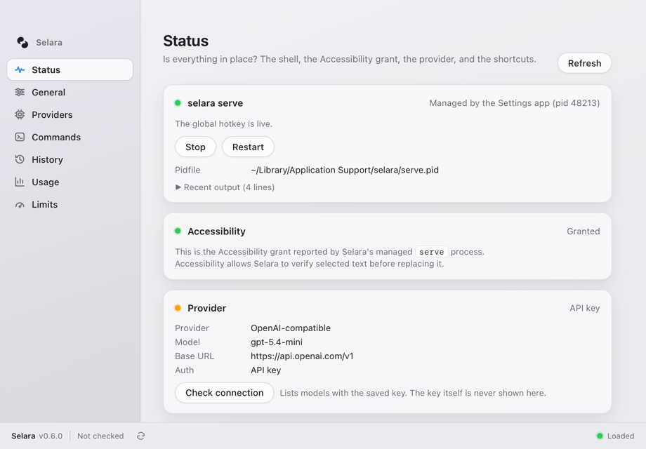

### General — Save button and bold in-card labels (2, 3)

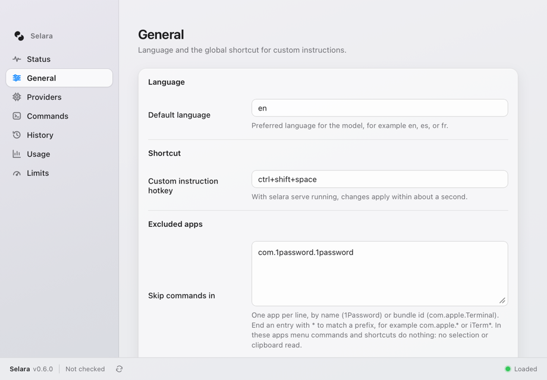

In the real window, the Custom instruction hotkey is still a raw text field (`ctrl+space`) although the command sheet has a shortcut recorder. That is outstanding item 6 of the [September 11 audit](../2026-09-11-ui-ux/REPORT.md).

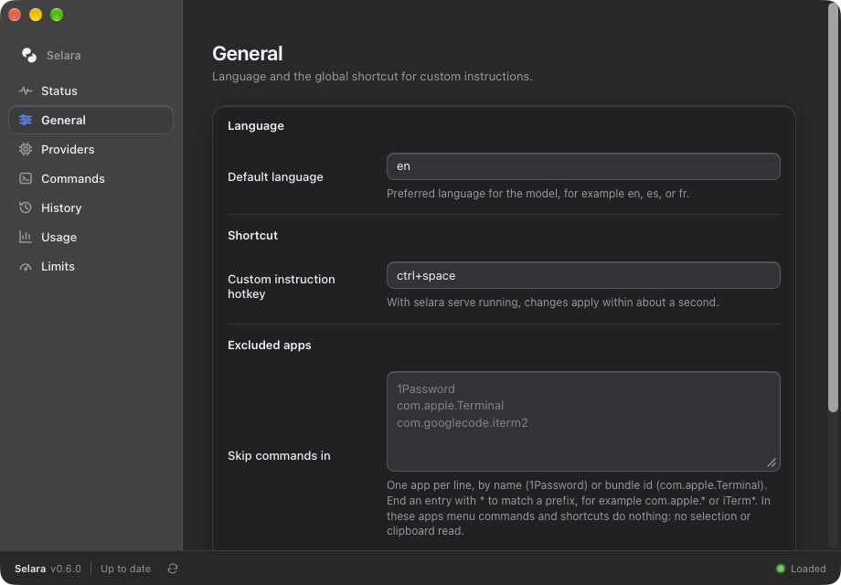

### Providers — two accents, custom switches, reflow (4, 8, 9)

The Store in OS keychain checkbox follows the system accent while switches and buttons use the fixed blue.

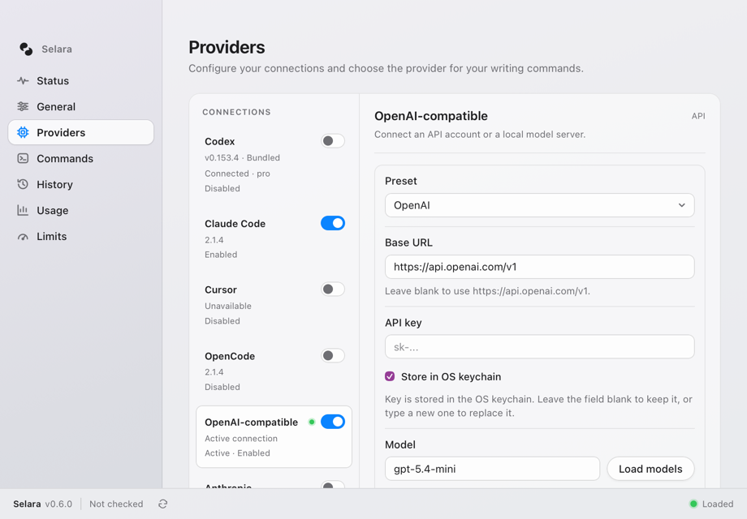

At the minimum size the layout reflows into a card grid, in the browser and in the real window.

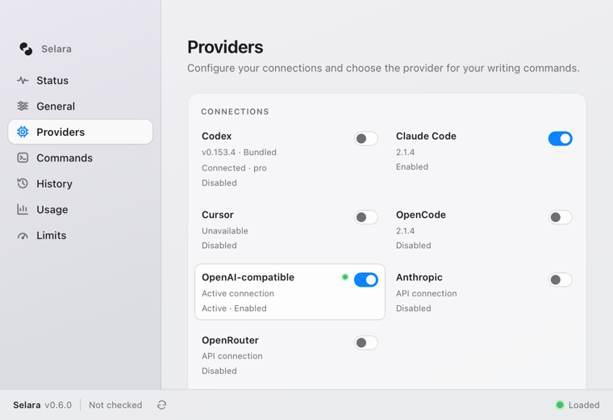

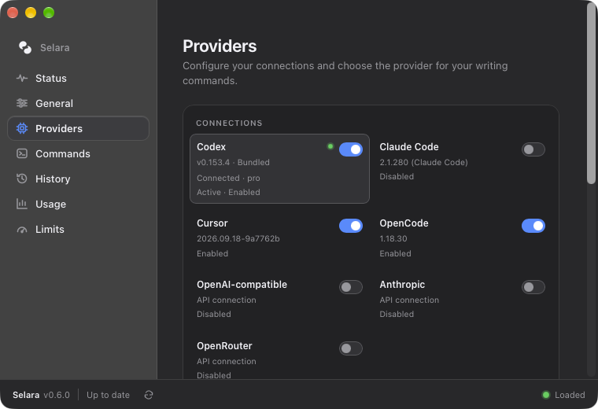

### Commands and the sheet (1, 6, 10)

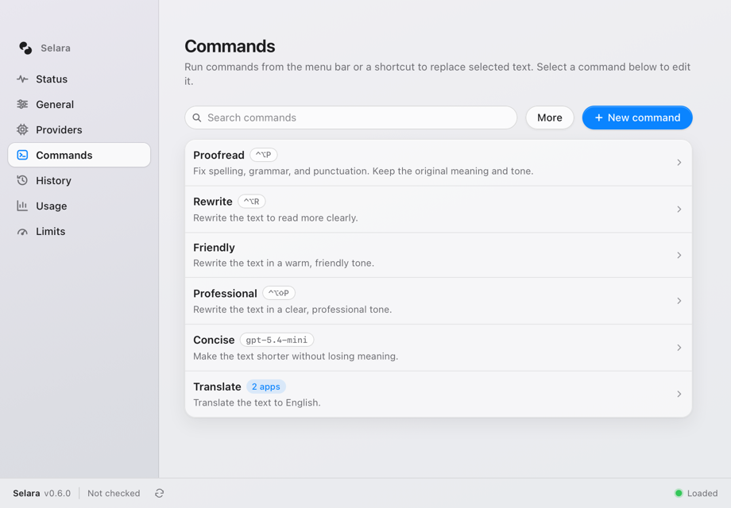

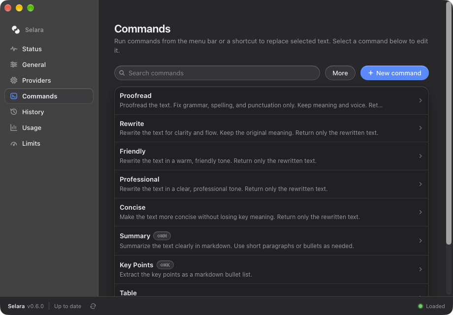

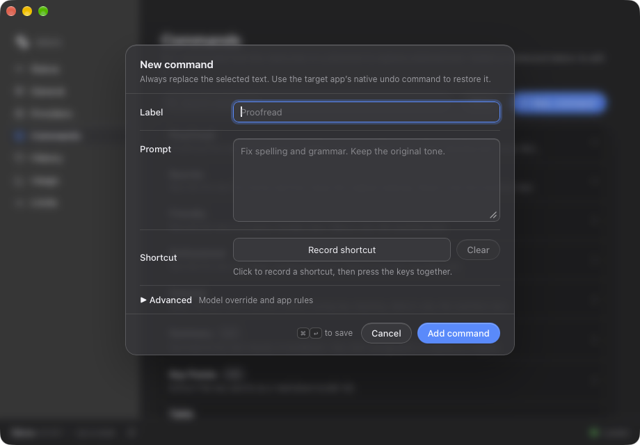

### History — repeated capsules and badge colors (6, 14)

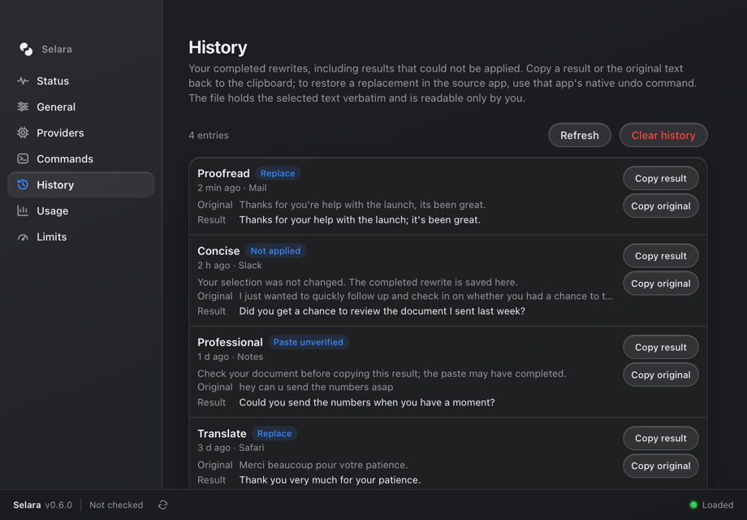

### Limits — status bar reports another page's activity (2, 4)

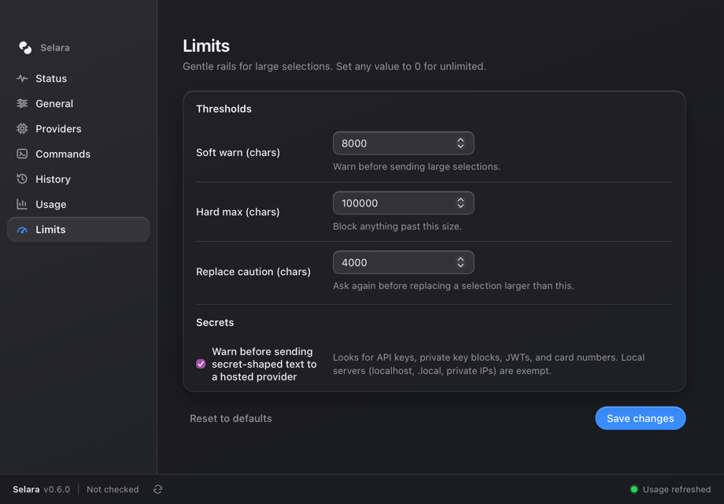

### Update available — footer controls (12)

The popover's see-through look here is the headless-WebKit `backdrop-filter` gap, not a finding.

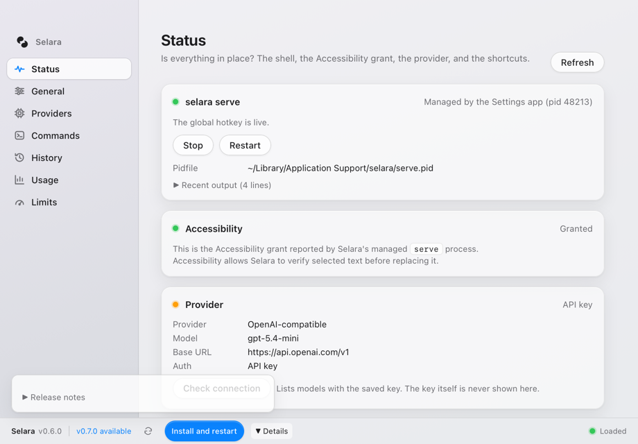

### First run at the minimum size — developer copy (14)

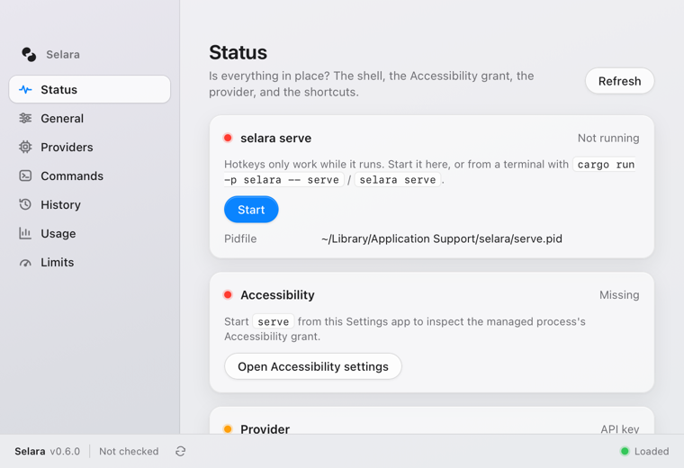

## Already native — keep

- System font stack (`-apple-system`, `ui-monospace`), 13 px body.
- `user-select: none` on chrome, selectable fields: native-lint found no selectable label text.
- `cursor: default` everywhere except the provider switch.
- Sidebar vibrancy (`NSVisualEffectMaterial::Sidebar`), overlay title bar, 48 px top inset clearing the traffic lights, drag regions on the sidebar and strip.
- Complete dark appearance; `prefers-reduced-motion` disables animation.
- No horizontal overflow in any section, scenario, size, or appearance (asserted by the suite).

## Constraints for implementation

- Element ids and `invoke` names are load-bearing (`AGENTS.md`). Restyling must keep ids such as `section-*`, `save-status`, `save-dot`, `status-updates`, `status-check-update`, `status-install-update`, `save-general`, `cmd-new`, `cmd-label`, and `sheet-root`, and every command in the bridge (`get_config`, `save_config_section`, `serve_*`, `chatgpt_*`, and so on). `tests/settings-dom.test.mjs` exercises many of them.
- Moving to apply-on-commit (finding 2) changes save semantics; keep `save_config_section` per-section writes and the draft-preservation behavior the DOM tests cover.
- Rebuild `dist/index.html` after UI changes; CI diffs it.
- The minimum macOS is 11.0, so `AccentColor` and `<input switch>` need fallbacks.

## Not covered

- VoiceOver order and announcements, Increase Contrast (no `prefers-contrast` rules exist), and Reduce Transparency were not evaluated.
- Light appearance in the real window (the machine was in dark appearance; it was not switched).
- `window.confirm` and `target="_blank"` behavior inside WKWebView.
- The menu-bar menu, custom-instruction panel, and progress orb (native, outside Settings).
- Observed once, unverified: quitting the running app with an Apple Event (`osascript -e 'quit app "Selara"'`) restarted `selara serve` and left the app running; SIGTERM exited cleanly. Worth a separate look at the quit path in `src-tauri/src/lib.rs`.

## Reproducing

```sh
cd apps/selara-desktop
npm run dev:mock          # http://localhost:1420/?scenario=configured|fresh|update|errors
npm run e2e               # 4 WebKit projects; screenshots and native-lint.json in e2e/artifacts/
```
