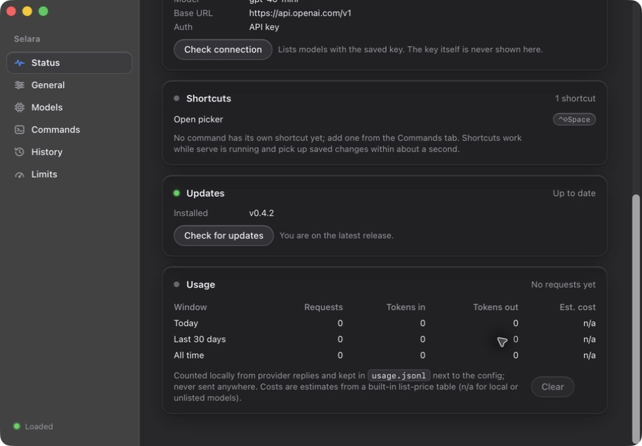
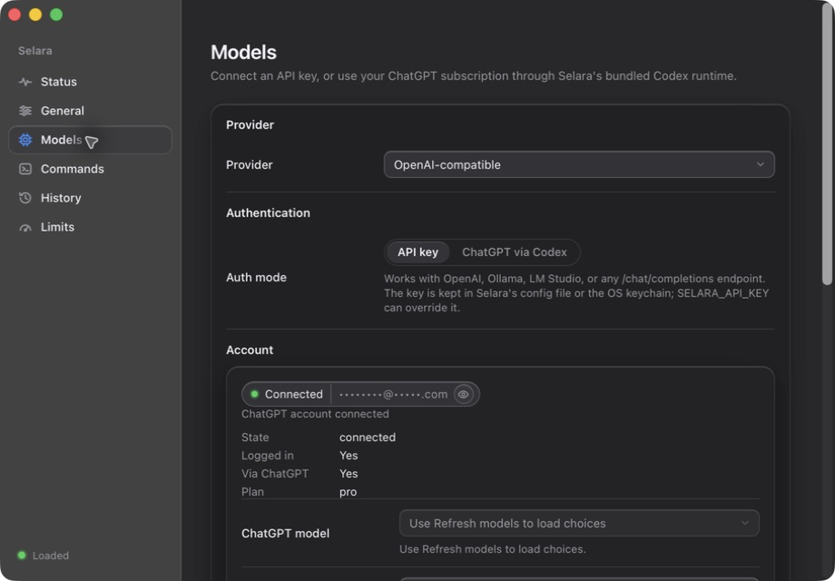
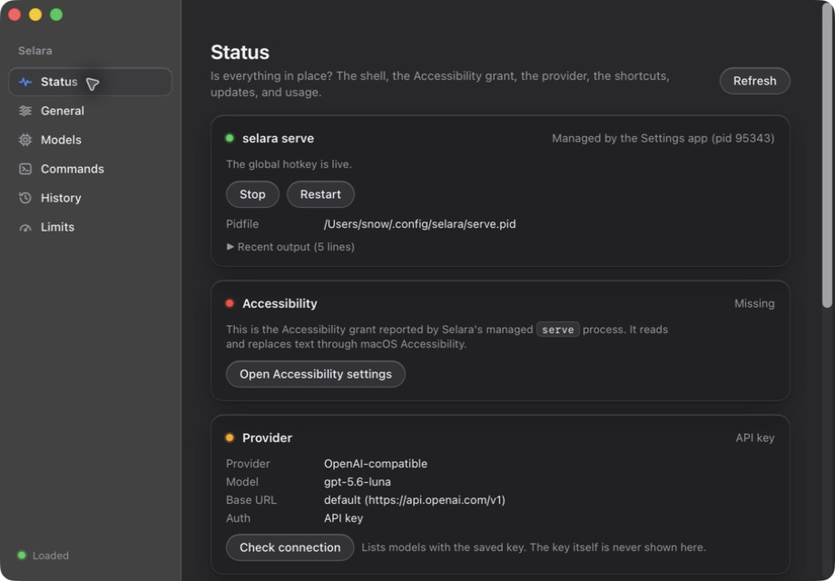

# macOS authentication, picker, and updater validation

Validated on Apple Silicon macOS on 2026-09-10. Implementation is ready for
review; the production rollout is **not complete**. No existing release or user
provider configuration was changed. Release-please still owns the next version.

## Baseline and causes

The installed v0.4.1 app was ad hoc signed and contained the placeholder updater
key. Its intentionally disabled updater cannot gain a trusted key remotely.
The installed Codex launcher also failed with `env: node: No such file or
directory` when launched with only `/usr/bin:/bin`, reproducing the dependency
on a terminal's environment.

Account refresh previously reloaded the Settings form, discarded drafts, and hid
account information in API-key mode. The picker requested initial invisibility
but did not repeat that request while hidden; the window backend could show its
first frame. Accessibility status queried Settings rather than the process that
reads and replaces selected text.

## Implemented safeguards

- Bundle the native writing-only Codex 0.153.4 runtime in the app and CLI archive.
  Its source revision, source archive digest, patch digest, build provenance,
  license, and notices are recorded. A capability handshake rejects incompatible
  runtimes. It uses official Codex authentication and text APIs, without the
  agent execution engine, tools, inherited instructions, hooks, notifications,
  or MCP configuration.
- Preserve shared credential-store choices and managed account restrictions.
  Authentication mutations use a canonical-home process lock, generations, and
  refresh conflict checks. External Codex processes cannot be made atomic with
  Selara; changed persisted credentials are detected. Requests are bounded and
  only successfully completed text may replace a selection.
- Separate account state from the settings draft; show connected, API-key-only,
  signed-out, checking, and error states. Support saved `provider.codex_home`,
  browser sign-in cancellation, account details, and independent model refresh.
- Keep the picker hidden while idle, use Accessory activation, and report the
  actual managed process's Accessibility trust. Explicit app launches show
  Settings; login startup keeps it hidden. Existing enabled login items migrate
  to the background argument without enabling disabled login items.
- Require the managed worker's quiescence acknowledgement before update stop.
  Exclude concurrent installation and supervisor transitions, verify downloads
  before pausing work, and retain a verified persistent backup for handled
  restoration failures. Frontend permissions cannot directly spawn sidecars or
  bypass the custom updater transaction. Complete the transaction and release
  supervisor locks before requesting a Tauri restart, whose shutdown handlers
  need those same locks; maintenance continues to prevent new work until exit.
- Require Apple signing/notarization and the persistent updater key in production;
  fail before compilation when credentials are missing or invalid. Keep local
  builds usable and CI updater keys separate. Verify release contents before
  reuse or signing, publish the feed last, and reject conflicting assets and
  Homebrew downgrades.

## Automated verification

Commands run with Rust 1.95.0 where applicable:

| Check | Result |
| --- | --- |
| `cargo fmt --all -- --check` | Passed |
| `cargo clippy --workspace --all-targets -- -D warnings` | Passed |
| `cargo test --workspace` | Passed: 262 tests; two intentionally ignored core tests (native handshake separately exercised) |
| `cargo test -p selara-desktop legacy_login_item -- --nocapture` | Passed with the actual autostart plugin in a subprocess with an isolated home; independently rerun by reviewer |
| `cargo test -p selara-core native_runtime_handshake -- --ignored` | Passed against the actual packaged runtime build |
| `npm --prefix apps/selara-desktop test` | 28 passed, including 10 DOM tests |
| `npm --prefix apps/selara-desktop run build` | Passed; committed dist regenerated |
| `node --test scripts/release/*.test.mjs` | 30 passed |
| `scripts/codex-runtime/test-contract.sh` | Production runtime contract passed |
| `scripts/codex-runtime/test-runtime.sh` | 12 actual runtime isolation/protocol tests passed |
| `scripts/codex-runtime/test-auth-lock.sh` | Eight cross-process authentication race tests passed |
| Upstream Codex credential storage suites | 25 storage tests and one additional keyring test passed; mocked storage is distinguished from live login below |
| `actionlint` 1.7.12 | All workflows passed |
| CI-mode full macOS app, DMG, and updater packaging | Passed using a temporary updater key and ad hoc Apple signatures |

The updater tests use the actual Tauri downloader and signature verifier against
an isolated HTTP fixture. They cover valid downloads, signature tampering,
interruption, and a missing feed. Installer tests cover unsafe archives,
concurrent installation (including a duplicated file descriptor surviving its
owner), replacement and restoration failures, and a successful
transition between two distinct ad hoc signed miniature macOS app bundles.
These are fixture transitions, not the required final production update.

A separate native smoke test built two complete Selara apps with temporary
version overrides (0.4.1 and 0.4.2), a test updater key, and ad hoc Apple
signatures. It used a loopback feed and an isolated home and installation under
`/private/tmp`. Selecting **Install and restart** exited the old desktop and
managed worker; the replacement desktop launched within eight seconds and
Settings showed v0.4.2, Up to date, and a new managed worker. No automation
relaunched the app during that transition. This exercises the actual Tauri
shutdown path and guards against restart deadlocks; it does not verify
Developer ID signing, notarization, or Gatekeeper acceptance. Repository version
files and the user's installed app were unchanged.

Authentication tests exercise synthetic homes containing instructions, hooks,
notifications, MCP configuration, managed restrictions, and file/keyring storage.
They cover stale refreshes, login/logout races, delayed callbacks, and cancelled
old logins. No fixture command may execute. Native production account lookup and
text generation were separately checked using the existing account.

Independent review covered runtime isolation, shared authentication, process
coordination, update restoration, and partial release recovery. Findings were
fixed and re-reviewed; the final review reported no remaining actionable issues.

## Native packaged-app observations

- Finder launched the packaged Settings app. Account lookup with no Node and a
  minimal PATH detected the existing ChatGPT account. Settings showed Connected,
  a masked email, and the plan while API-key mode remained selected.
- Refreshing account status preserved an unsaved model draft. Model discovery
  returned seven models. Switching the displayed auth mode and refreshing models
  did not save over the user's provider settings.
- The packaged CLI, launched with only HOME and `/usr/bin:/bin`, used the shared
  ChatGPT account to rewrite `This are a harmless Selara test.` as
  `This is a harmless Selara test.` A temporary Selara config and usage ledger
  isolated this request from the user's provider settings.
- Settings started, restarted, and stopped its managed worker. The worker's
  Accessibility status was Missing, and it reset to Unknown after stopping.
  The current public release's missing update feed displayed Check failed with
  Retry and a GitHub DMG fallback, rather than claiming the app was up to date.
- The packaged worker passed protocol readiness, quiescence, status, resume,
  and clean shutdown checks with a minimal environment. Launched by the trusted
  test host it reported Accessibility as Granted, while the app-managed worker
  reported Missing. This does not establish permission for the app-managed
  selection process; that live verification remains required.
- No persistent extra picker window was observed during these Settings launches
  and restarts. Frame-by-frame cold-launch behavior and a complete interactive
  picker cycle are not established by this observation; see the remaining gate.

The final packaging verification checks app and both executable signatures, the
bundled CLI and native runtime, runtime notices, DMG integrity, and the updater
archive signature. The local validation app embeds a **temporary test key** and
must not be distributed as the production release.

## Remaining gates before merge and publication

1. Apple Developer membership was **Pending**, and no usable Developer ID signing
   identity was available. Finish activation, configure the certificate with its
   private key and notarization credentials, then pass production preflight.
   Developer ID signatures, notarization, stapled tickets, and Gatekeeper
   acceptance have not been verified for this repair.
2. The persistent updater private key is encrypted locally, its password is in
   Keychain, and the GitHub signing secrets are configured. Restoring that local
   encrypted copy and signing against the committed public key passed. An
   independent backup destination and restore test still need verification.
   Only the public key is committed.
3. Grant/revoke Accessibility for the corrected signed worker and exercise actual
   picker invocation, filtering, focus return, selection replacement, undo,
   dismissal, hotkeys, and cold launch. This machine reported Missing for the
   validation worker; a complete live replacement cycle was not verified.
4. Validate browser OAuth completion, cancellation, and shared-account logout in
   a dedicated live test account. The existing user's account was read and used
   for the sample rewrite, not logged out or replaced for testing.
5. Run two distinct full production-signed/notarized builds through an isolated
   feed. Verify actual installation/relaunch, busy work, prevention of late
   replacement, interruption, and recovery behavior. Fixture coverage alone
   does not close this gate.
6. After these gates and CI pass, merge, let release-please assign the version,
   and verify all nine published assets, checksums, signatures, notarization,
   repeated/partial recovery, and the latest feed. Install the first corrected
   release manually: v0.4.1 cannot bootstrap its disabled updater.

See [release and updater operations](release-updater.md) and the
[writing runtime maintenance guide](../vendor/codex-runtime/README.md).
